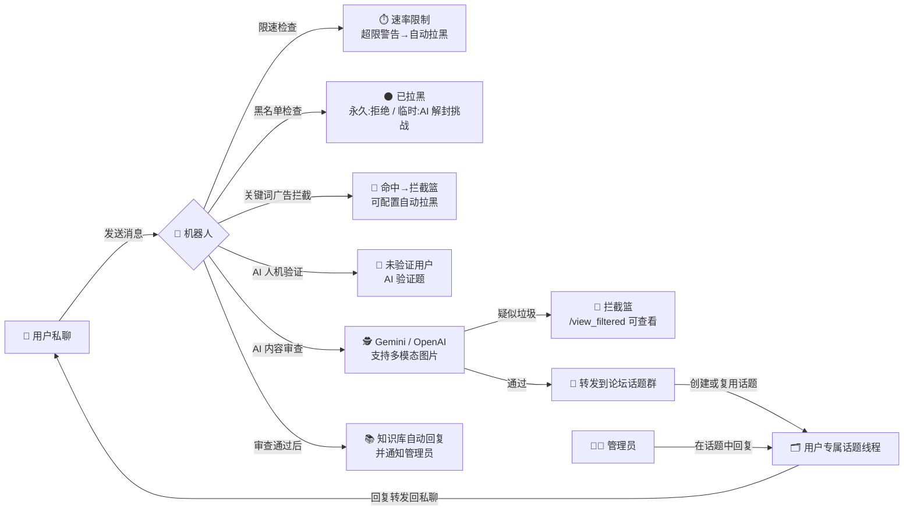

<h1 align="center">🛡️ pivkeyu_pmbot — Telegram 双向聊天机器人</h1>

<p align="center">
  <em>用户消息直达管理员，AI 审查护航，论坛话题群管理，全维度监控</em>
</p>

<p align="center">
  
  
  
  
  <a href="https://github.com/PivKeyU/pivkeyu_pmbot/stargazers">
    
  </a>
</p>

---

## 📜 目录

- [📖 项目简介](#-项目简介)
- [✨ 功能特性](#-功能特性)
- [🏗️ 架构与消息流](#️-架构与消息流)
- [🚀 快速开始](#-快速开始)
- [🔧 配置说明](#-配置说明)
- [📖 使用指南与命令参考](#-使用指南与命令参考)
- [❓ 常见问题 (FAQ)](#-常见问题-faq)
- [🧰 技术栈](#-技术栈)
- [🤝 贡献指南](#-贡献指南)
- [📄 许可证](#-许可证)

---

## 📖 项目简介

一个功能完善、AI 驱动的 Telegram 双向聊天机器人：用户通过私聊把消息交给机器人，机器人自动为每位用户创建**论坛话题 (Forum Topic)** 工单转发给管理员，管理员在话题中回复后实时回传用户——既是客服工单系统，也是反骚扰安全网关。

核心卖点：**AI 内容审查 + AI 人机验证 + 关键词广告拦截** 三重防护过滤垃圾与骚扰，同时提供 TG 群/频道关键词监听、网页变化监控、RSS 订阅推送等监控能力，配合 `/inbox` 待办聚合、安全自更新等运维工具，开箱即用。

**适用于以下场景：**

- 需要屏蔽骚扰/垃圾消息的公开 Telegram 客服机器人
- 管理员想用「私聊 → 论坛话题工单」模式集中处理用户消息
- 需要监听 TG 群/频道关键词、网页价格/库存变化、RSS 更新推送

---

## ✨ 功能特性

### 🗣️ 双向沟通

| 特性 | 说明 |
| :--- | :--- |
| 💬 **论坛话题工单** | 每位用户自动分配独立话题线程，消息自动附带用户信息，便于追溯与管理 |
| 📦 **全媒体递送** | 转发文本、图片、视频、音频、语音、文档、贴纸，并保留 Markdown 格式 |
| 🔄 **双向同步** | 用户消息转发到话题，管理员在话题中回复自动回传；双方**编辑**消息也会同步更新 |
| 📋 **待办小本本 `/inbox`** | 列出最近发来消息、管理员尚未回复的用户话题，附内容预览与深链一键跳转 |

### 🤖 AI 能力

| 特性 | 说明 |
| :--- | :--- |
| 🕵️ **AI 内容审查** | Gemini / OpenAI 双提供商，识别垃圾信息与恶意内容，支持图片等多模态输入 |
| 🧩 **AI 人机验证** | 新用户首次交互需完成 AI 生成的验证题，答错自动换题，超限自动拉黑 |
| 📚 **知识库自动回复** | 审查通过后基于知识库自动回答用户，支持 Markdown，回复同时通知管理员 |
| 🎨 **AI 模型衣柜** | `/panel` 中为「内容审查 / 验证题生成 / 自动回复」分别挑选模型，可动态切换提供商与模型 |

### 🛡️ 安全防护

| 特性 | 说明 |
| :--- | :--- |
| ⚫ **黑名单管理** | 管理员可拉黑/解封用户；被拉黑用户可答 AI 挑战题自助解封（永久拉黑除外） |
| 🚫 **关键词广告拦截** | 在 AI 审查前做轻量关键词拦截，可配置命中后自动拉黑，降低固定话术处理成本 |
| 🎫 **审查通行证** | 为可信用户发放临时（按小时）/永久豁免，跳过 AI 内容审查，其余规则仍生效 |
| ⏱️ **速率限制** | 按用户限速，多次超限自动永久拉黑，防刷屏攻击 |

### 🔎 监控体系

| 特性 | 说明 |
| :--- | :--- |
| 📡 **TG 群/频道监听** | Bot 入群监听 + Telethon 用户会话监听（Bot 无法加入的群/频道），关键词命中推送管理员；`/tgmon discovered` 不再包含论坛群自身，避免污染发现列表 |
| 🕸️ **网页监控** | CSS 选择器解析条目，支持新条目、关键词命中、内容/价格/库存变化提醒 |
| 📰 **RSS 订阅推送** | 私聊管理订阅源、关键词、自定义页脚与链接预览；新条目最多推送 5 条，多余用摘要提示防刷屏 |
| 📊 **运行状态** | `/monitor_status` 查看 RSS / TG / 网页监控的运行状态记录 |

### 🛠️ 管理工具

| 特性 | 说明 |
| :--- | :--- |
| 🎛️ **女仆长面板 `/panel`** | 统计、黑名单、拦截篮、豁免名单、自动回复、广播分组、监控、模型等一站式管理 |
| 📢 **分组与广播** | 管理用户分组，向全部用户或指定分组广播消息 |
| 🌐 **网络测试** | 通过 SSH 远程服务器执行 Ping 与 NextTrace 路由追踪（ICMP/TCP），管理员授权后可用 |
| 🔧 **安全更新** | `/updatebot` 仅执行 `ff-only` 更新并支持回滚，本地有未提交改动时拒绝更新 |
| 🗄️ **aiosqlite 连接池** | 8 连接池 + 事务安全包装（出错自动回滚），高并发下数据库读写稳定 |

---

## 🏗️ 架构与消息流



> 管理员在话题中的回复与**编辑**都会被同步回用户的私聊会话；用户的编辑同样会同步到话题中。

---

## 🚀 快速开始

> [!TIP]
> 推荐使用 Docker 部署，免去环境配置的麻烦。配置文件与数据均存放在宿主机，升级容器不丢数据。

### 1. 准备配置

创建部署目录并下载配置模板（或直接复制本仓库的 `.env.example`）：

```bash
mkdir tg-bot-data && cd tg-bot-data
wget https://raw.githubusercontent.com/PivKeyU/pivkeyu_pmbot/main/.env.example -O .env
nano .env   # 填入 BOT_TOKEN、FORUM_GROUP_ID、ADMIN_IDS 等配置
```

### 2. 使用 Docker Compose（推荐）

```yaml
services:
  pivkeyu-pmbot:
    container_name: pivkeyu-pmbot
    image: pivkeyu/pivkeyu_pmbot:latest
    restart: unless-stopped
    env_file:
      - .env
    volumes:
      - ./data:/app/data
```

```bash
docker compose up -d
```

更新容器：

```bash
docker compose down && docker compose pull && docker compose up -d
```

> 使用 [Watchtower 自动更新本项目](watchtower/README.md)（仓库提供 `watchtower/docker-compose.yml`，含 shoutrrr 通知配置示例）。

### 3. 使用 Docker Run

```bash
docker run -d \
  --name pivkeyu-pmbot \
  -v $(pwd)/.env:/app/.env \
  -v $(pwd)/data:/app/data \
  --restart unless-stopped \
  pivkeyu/pivkeyu_pmbot:latest
```

> **命令解析：** `-d` 后台运行；`--name` 指定容器名；两个 `-v` 分别挂载 `.env` 配置与 `data` 数据目录（持久化 SQLite 数据库与监控数据）；`--restart unless-stopped` 容器退出自动重启；末尾为 Docker Hub 镜像名（也可用仓库根目录的 `docker-compose.yml` 中引用的镜像名）。

### 4. 手动部署（可选）

```bash
git clone https://github.com/PivKeyU/pivkeyu_pmbot.git
cd pivkeyu_pmbot

# 创建并激活虚拟环境
python -m venv venv
source venv/bin/activate        # Linux/Mac
# venv\Scripts\activate         # Windows

pip install -r requirements.txt

# 配置环境变量
cp .env.example .env
nano .env

# 启动
python bot.py
```

---

## 🔧 配置说明

所有配置通过 `.env` 文件加载（项目使用 `python-dotenv`）。以下变量以 `.env.example` 为准逐项列出；**扩展配置**（TG 监听、关键词拦截、RSS）由代码 `config.py` 读取并提供默认值，可按需自行追加到 `.env`。

### Bot / 管理员

| 变量 | 必填 | 说明 |
| :--- | :---: | :--- |
| `BOT_TOKEN` | ✅ | Telegram Bot Token，从 [@BotFather](https://t.me/BotFather) 获取 |
| `FORUM_GROUP_ID` | ✅ | 论坛话题群组 ID（超级群组需开启 Topics），机器人须为该群管理员 |
| `ADMIN_IDS` | ✅ | 管理员 Telegram 用户 ID，多个用逗号分隔 |

### AI

| 变量 | 必填 | 说明 |
| :--- | :---: | :--- |
| `GEMINI_API_KEY` | ❌ | Gemini API 密钥（从 [Google AI Studio](https://aistudio.google.com/api-keys) 获取），启用 AI 功能需要 |
| `GEMINI_BASE_URL` | ❌ | Gemini 自定义 Base URL，留空使用官方接口 |
| `ENABLE_AI_FILTER` | ❌ | 是否启用 AI 内容审查，默认 `true` |
| `AI_CONFIDENCE_THRESHOLD` | ❌ | AI 判断置信度阈值（0-100），高于此值判定为恶意内容，默认 `70` |
| `OPENAI_API_KEY` | ❌ | OpenAI API 密钥（可选，作为第二提供商） |
| `OPENAI_BASE_URL` | ❌ | OpenAI Base URL，默认 `https://api.openai.com/v1` |

### 功能开关 / 数据库 / 性能

| 变量 | 必填 | 说明 |
| :--- | :---: | :--- |
| `VERIFICATION_ENABLED` | ❌ | 是否启用新用户 AI 人机验证，默认 `true` |
| `AUTO_UNBLOCK_ENABLED` | ❌ | 是否启用黑名单用户 AI 挑战自助解封，默认 `true` |
| `DATABASE_PATH` | ❌ | SQLite 数据库路径，默认 `./data/bot.db`（容器内路径通常无需修改） |
| `MAX_WORKERS` | ❌ | 消息队列 Worker 数量，默认 `5`（预留配置，当前代码未使用） |
| `QUEUE_TIMEOUT` | ❌ | 队列消息超时时间（秒），默认 `30`（预留配置，当前代码未使用） |

### 验证 / 限速

| 变量 | 必填 | 说明 |
| :--- | :---: | :--- |
| `VERIFICATION_TIMEOUT` | ❌ | 人机验证超时时间（秒），默认 `300` |
| `MAX_VERIFICATION_ATTEMPTS` | ❌ | 用户最大尝试验证次数，默认 `3`，超限自动拉黑 |
| `MAX_MESSAGES_PER_MINUTE` | ❌ | 每用户每分钟最大消息数，默认 `30`，忽略警告会永久拉黑 |

### Watchtower 通知钩子（默认禁用）

| 变量 | 必填 | 说明 |
| :--- | :---: | :--- |
| `WATCHTOWER_NOTIFICATIONS` | ❌ | 使用 shoutrrr 作为统一通知系统，启用需去除 `#` 注释并设为 `shoutrrr` |
| `WATCHTOWER_NOTIFICATION_URL` | ❌ | 通知渠道钩子，如 `telegram://token@telegram?chats=channel-1[,chat-id-1,...]` |

### 🔎 扩展配置：TG 群/频道关键词监听

| 变量 | 必填 | 说明 |
| :--- | :---: | :--- |
| `TG_API_ID` / `TG_API_HASH` | ❌ | Telegram API ID 与 Hash，从 https://my.telegram.org 获取，user_session 监听需要 |
| `TG_API_SESSION` | ❌ | Telethon StringSession，**未配置时用户会话监听不会启动** |
| `TG_PROXY` | ❌ | 可选代理，如 `socks5://127.0.0.1:1080` 或 `http://127.0.0.1:7890` |
| `TG_MONITOR_ENABLED` | ❌ | 是否允许启动 TG 监听服务，默认 `true` |
| `TG_MONITOR_DEFAULT_SOURCE` | ❌ | 新监听默认来源：`user_session` 或 `bot`，默认 `user_session` |
| `TG_MONITOR_NOTIFY_CHAT_IDS` | ❌ | TG 监听推送目标（逗号分隔），留空则使用 `ADMIN_IDS` |

### 🚫 扩展配置：关键词广告拦截

| 变量 | 必填 | 说明 |
| :--- | :---: | :--- |
| `SPAM_KEYWORD_FILTER_ENABLED` | ❌ | 是否启用关键词广告拦截，默认 `false` |
| `SPAM_KEYWORD_AUTO_BLOCK` | ❌ | 命中后是否自动拉黑，默认 `true` |

### 📰 扩展配置：RSS（代码支持，未收录于 .env.example）

| 变量 | 必填 | 说明 |
| :--- | :---: | :--- |
| `RSS_ENABLED` | ❌ | 是否启用 RSS 轮询推送，默认 `false` |
| `RSS_DATA_FILE` | ❌ | RSS 订阅数据文件，默认 `./data/rss_subscriptions.json` |
| `RSS_CHECK_INTERVAL` | ❌ | RSS 轮询间隔（秒），默认 `300`，建议 ≥ 120 |
| `RSS_AUTHORIZED_USER_IDS` | ❌ | RSS 命令授权用户（逗号分隔），不填则仅 `ADMIN_IDS` 可用 |

---

## 📖 使用指南与命令参考

> 命令菜单会在启动时自动同步到 Telegram（私聊 / 群聊分别设置）。以下命令表与代码 `services/telegram_commands.py` 保持一致。

### 👤 用户命令（私聊与群聊通用）

| 命令 | 描述 |
| :--- | :--- |
| `/start` | 唤醒女仆（仅私聊） |
| `/getid` | 查看主人 ID / 查看群组 ID |
| `/ping` | 端来 Ping 测试 |
| `/nexttrace` | 端来路由追踪 |
| `/adduser` | 登记授权主人（管理员） |
| `/rmuser` | 移除授权主人（管理员） |
| `/addserver` | 登记测试服务器（管理员） |
| `/rmserver` | 撤下测试服务器（管理员） |
| `/install_nexttrace` | 安装追踪工具（管理员） |

### 🧑‍💼 管理员命令（私聊）

| 命令 | 描述 |
| :--- | :--- |
| `/help` | 查看女仆小手册 |
| `/block` | 记入黑名单 |
| `/unblock` | 移出黑名单 |
| `/panel` | 打开女仆长面板 |
| `/blacklist` | 查看黑名单小本本 |
| `/stats` | 查看宅邸统计 |
| `/inbox` | 查看待办小本本 |
| `/view_filtered` | 查看拦截篮 |
| `/autoreply` | 安排自动回复女仆 |
| `/exempt` | 管理审查通行证 |
| `/group` | 管理用户分组 |
| `/broadcast` | 发送用户广播 |
| `/spamrules` | 管理关键词拦截 |
| `/tgmon` | 管理TG监听 |
| `/webmon` | 管理网页监控 |
| `/monitor_status` | 查看监听状态 |
| `/updatebot` | 安全更新机器人 |

> 群聊中同样注册以上管理员命令（除 `/help` 外），便于在话题内直接操作。

### 📰 RSS 命令（仅限私聊）

| 命令 | 描述 |
| :--- | :--- |
| `/rss_add <url>` | 添加 RSS 茶点 |
| `/rss_remove <url\|ID>` | 撤下 RSS 茶点 |
| `/rss_list` | 查看 RSS 茶点 |
| `/rss_addkeyword <id> <关键词>` | 添加 RSS 口味词 |
| `/rss_removekeyword <id> <关键词>` | 删除 RSS 口味词 |
| `/rss_listkeywords <id>` | 查看 RSS 口味词 |
| `/rss_removeallkeywords <id>` | 清空 RSS 口味词 |
| `/rss_setfooter [文本]` | 设置 RSS 小尾巴 |
| `/rss_togglepreview` | 切换链接预览 |
| `/rss_add_user <user_id>` | 登记 RSS 授权（管理员） |
| `/rss_rm_user <user_id>` | 移除 RSS 授权（管理员） |

### 🎯 常用功能速览

**TG 群/频道关键词监听**

```bash
/tgmon add 监听名称 -1001234567890 关键词1,关键词2 user_session
/tgmon list
/tgmon discovered
/tgmon on 1
/tgmon off 1
/tgmon delete 1
```

`user_session` 模式需要配置 `TG_API_ID`、`TG_API_HASH`、`TG_API_SESSION`；`bot` 模式需要机器人已经在目标群/频道中。支持 `keywords` / `exclude` / `interval` 子命令细化监听。

**网页关键词/变化监控**

```bash
/webmon add 监控名称 https://example.com 关键词1,关键词2
/webmon list
/webmon run 1
/webmon interval 1 300
/webmon off 1
```

首次检查只建立基线，不推送页面上已有内容；后续发现新条目、关键词命中或内容/价格/库存变化时推送管理员。

**关键词广告拦截**

```bash
/spamrules on
/spamrules add 广告词1,广告词2
/spamrules autoblock on
/spamrules
```

**运行状态与安全更新**

```bash
/monitor_status
/monitor_status rss
/monitor_status tg
/monitor_status web

/updatebot status
/updatebot apply
/updatebot rollback
```

`/updatebot apply` 会拒绝覆盖本地未提交改动，只执行 `ff-only` 更新。

### 🔑 获取必要信息

1. **Bot Token**：与 [@BotFather](https://t.me/BotFather) 对话，使用 `/newbot` 创建机器人即可获得。
2. **话题群组 ID**：创建超级群组并启用「话题」(Topics)，将机器人添加为管理员，在群组中发送 `/getid`，机器人会自动回复群组 ID。
3. **Gemini API 密钥**（可选）：访问 [Google AI Studio](https://aistudio.google.com/api-keys) 创建。
4. **Telethon StringSession**（可选，user_session 监听）：在 https://my.telegram.org 获取 API ID/Hash，再用任意 Telethon 工具生成 StringSession 填入 `TG_API_SESSION`。

---

## ❓ 常见问题 (FAQ)

**Q1：用户发了消息，为什么管理员没收到？**

消息要经过「限速 → 黑名单 → 关键词拦截 → 人机验证 → AI 审查」多道关卡，任一关被拦下管理员就收不到：

1. **触发限速**：收到限速提醒后继续刷屏会被自动拉黑；
2. **被拉黑**：永久拉黑直接拒绝，临时拉黑需完成 AI 解封挑战；
3. **命中关键词广告拦截**：消息进入拦截篮，管理员可用 `/view_filtered` 查看；
4. **未通过 AI 人机验证**：新用户首次发消息会收到验证题，答对后才递送；
5. **AI 审查判为垃圾**：同样进入拦截篮，不会转发到话题群。

**Q2：如何获取群组 ID？**

把机器人加为群组管理员，在群里发送 `/getid`，机器人会回复「群组 ID」和「您的用户 ID」。

**Q3：`user_session` 监听需要什么？**

必须同时满足：Telethon 已安装（`requirements.txt` 自带）；`TG_API_ID`、`TG_API_HASH`、`TG_API_SESSION` 三项完整配置（缺任一项监听都不会启动）；`TG_MONITOR_ENABLED` 为 `true`；且存在至少一个启用中、来源为 `user_session` 的监听。

**Q4：`/updatebot apply` 失败怎么办？**

失败是保护机制生效：本地有未提交改动、本地分支领先远端、或没有可用的回滚点。先提交/清理本地改动再重试；`/updatebot rollback` 可回滚到上一次更新前。

**Q5：验证失败被拉黑，还能解封吗？**

临时拉黑可重新发消息触发 AI 解封挑战自动开门；永久拉黑（管理员 `/block`、关键词拦截自动拉黑、多次超限等）只能由管理员 `/unblock` 解封。

**Q6：为什么 `/tgmon discovered` 看不到我的论坛群？**

这是刻意设计：论坛话题群自身（`FORUM_GROUP_ID`）不会再被记录进发现列表，避免污染 `/tgmon discovered`；其余群/频道照常被发现与监听。

**Q7：网页监控添加后为什么不推送？**

首次检查只建立基线、不推送已有内容；之后出现新条目、关键词命中或内容/价格/库存变化才会推送。可先用 `/webmon run <ID>` 手动触发一次检查验证。

**Q8：RSS 命令没反应？**

RSS 命令仅限私聊使用，且只有 `ADMIN_IDS` 与 `RSS_AUTHORIZED_USER_IDS` 中的用户可用；另外 `RSS_ENABLED` 默认 `false`，未开启时不会轮询推送（可在 `/panel` → RSS 功能管理中开启）。

---

## 🧰 技术栈

| 技术 | 用途 |
| :--- | :--- |
| [Python 3.11+](https://www.python.org/) | 开发语言（Docker 基础镜像 `python:3.11-slim`） |
| [python-telegram-bot v20+](https://github.com/python-telegram-bot/python-telegram-bot) | Telegram Bot 框架（长轮询 + 异步） |
| [aiosqlite](https://github.com/omnilib/aiosqlite) | 异步 SQLite，内置 8 连接池与事务安全包装 |
| [Google Gemini](https://ai.google.dev/) | AI 内容审查 / 验证题生成 / 自动回复 / 多模态识别 |
| [OpenAI](https://openai.com/) | 可选第二 AI 提供商 |
| [Telethon](https://github.com/LonamiWebs/Telethon) | 用户会话监听 Bot 无法加入的群/频道 |
| [aiohttp](https://docs.aiohttp.org/) | 异步 HTTP 抓取（网页监控） |
| [BeautifulSoup4](https://www.crummy.com/software/BeautifulSoup/) | 网页 CSS 选择器解析 |
| [feedparser](https://pythonhosted.org/feedparser/) | RSS 解析 |
| [paramiko](https://github.com/paramiko/paramiko) | SSH 远程网络测试（Ping / NextTrace） |
| [Docker](https://www.docker.com/) | 容器化部署（amd64 / arm64 多架构镜像） |

---

## 🤝 贡献指南

欢迎任何形式的贡献！如果您有好的想法或发现了 Bug，请随时提交 Pull Request 或创建 Issue。

开发小贴士：项目包含 `pytest` / `pytest-asyncio` 测试依赖，提交前建议运行 `black` 与 `flake8`（见 `requirements.txt` 开发工具段）。

## 📄 许可证

本项目采用 [MIT 许可协议](LICENSE)。

---

<p align="center">
  如果这个项目对你有帮助，请给个 Star ⭐️
</p>
<p align="center">
  <a href="https://www.star-history.com/#PivKeyU/pivkeyu_pmbot&type=date">
    
  </a>
</p>
