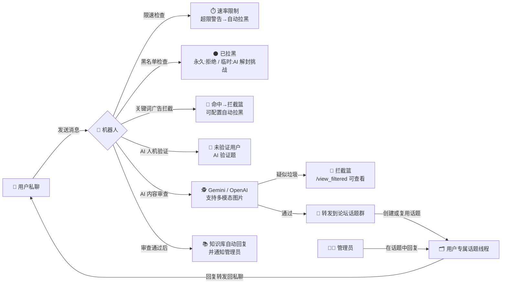

<div align="center">

# 🛡️ pivkeyu_pmbot

### AI 驱动的 Telegram 双向聊天机器人 · 论坛话题工单 · 全维度安全防护

用户私聊自动变成一条论坛话题工单，管理员在话题里回复即可实时回传用户；同时是反骚扰安全网关与监控运维平台。

[](https://www.python.org/)
[](https://python-telegram-bot.org/)
[](https://github.com/omnilib/aiosqlite)
[](https://ai.google.dev/)
[](https://hub.docker.com/r/pivkeyu/pivkeyu_pmbot)
[](LICENSE)
[](https://github.com/PivKeyU/pivkeyu_pmbot/actions/workflows/docker-publish.yml)
[](https://github.com/PivKeyU/pivkeyu_pmbot/stargazers)

**私聊直达管理员 · 论坛话题工单 · AI 双重防护 · 群频道与网页监控 · 面板远程运维**

</div>

## 📜 目录

- [✨ 特性一览](#-特性一览)
- [🚀 快速开始](#-快速开始)
- [🎭 人设与语气](#-人设与语气)
- [🧠 工作原理](#-工作原理)
- [🛡️ 安全防线](#️-安全防线)
- [📡 监控体系](#-监控体系)
- [🛠️ 运维工具](#️-运维工具)
- [🔧 配置参考](#-配置参考)
- [📖 命令参考](#-命令参考)
- [💻 开发](#-开发)
- [📋 部署检查清单](#-部署检查清单)
- [❓ 常见问题](#-常见问题)
- [🧰 技术栈](#-技术栈)
- [🤝 参与贡献](#-参与贡献)
- [📄 许可证](#-许可证)

---

## ✨ 特性一览

| 方向 | 能力 |
| --- | --- |
| 🗣️ **双向沟通** | 每位用户自动分配独立论坛话题线程，消息附带用户信息卡片 · 文本 / 图片 / 视频 / 音频 / 语音 / 文档 / 贴纸 / 动画全媒体递送并保留 Markdown · 双方**编辑**消息同步 · 回复后打 👁️ 已读标记 · `/inbox` 聚合待回复话题 |
| 🤖 **AI 能力** | Gemini / OpenAI 双提供商，可在面板里切换 · AI 内容审查支持图片等多模态输入 · 知识库自动回复并通知管理员 · 可按「内容审查 / 验证题生成 / 自动回复」分别挑选模型 |
| 🧩 **人机验证** | 新用户首次交互需完成 AI 验证题，答错自动换题、超限拉黑 · 被临时拉黑的用户可答 AI 挑战题自助解封 · 无 API Key 时自动使用内置本地题库兜底 |
| 🛡️ **安全防护** | 四道关卡：限速 → 黑名单 → 关键词广告拦截 → AI 人机验证与内容审查 · 黑名单 / 审查通行证 / 速率限制 / 自动拉黑策略均可在面板配置 |
| 📡 **TG 群频道监听** | Bot 入群监听 + Telethon 用户会话监听（Bot 无法加入的群 / 频道）· 关键词、排除词、去重与最小推送间隔 |
| 🕸️ **网页监控** | CSS 选择器解析条目 · 新条目、关键词命中、内容 / 价格 / 库存变化提醒 · 任务防重叠 |
| 📰 **RSS 推送** | 私聊管理订阅源、口味词（关键词）、小尾巴（自定义页脚）与链接预览 · 单次最多推送 5 条，多余用摘要提示防刷屏 |
| 🎛️ **女仆长面板** | `/panel` 一站式管理统计、黑名单、拦截篮、通行证名单、自动回复、广播分组、监控与 AI 模型 |
| 🌐 **网络测试** | 通过 SSH 在远程服务器执行 ICMP / TCP Ping 与 NextTrace 路由追踪 · 目标地址做防注入校验 |
| 🔧 **更新与部署** | `/updatebot` 仅执行 `ff-only` 更新并支持回滚 · Docker 下由面板触发 Watchtower 拉镜像重建容器 · 镜像多架构 amd64 / arm64 |

### 设计边界

- ❌ 不提供网页管理后台：统计、黑名单、拦截篮、模型、广播全部通过 Telegram 的 `/panel` 面板完成
- ⚠️ 论坛话题群必须开启 Topics 且机器人须为管理员，否则**除 `/getid` 外全部功能禁用**
- ⚠️ 工单流只存在于「用户私聊 ↔ 论坛话题」之间；群聊里只响应 8 个命令（`/getid` `/ping` `/nexttrace` `/adduser` `/rmuser` `/addserver` `/rmserver` `/install_nexttrace`），不做群内工单
- ⚠️ TG 用户会话监听（`user_session` 模式）需单独配置 `TG_API_ID` / `TG_API_HASH` / `TG_API_SESSION`，未配置时不会启动，只能监听机器人已加入的群 / 频道
- ✅ 网络测试的目标地址经过严格校验（`validate_target` + `shlex.quote`），防止 SSH 命令注入
- ✅ `/updatebot` 只执行 `ff-only` 更新，本地存在未提交改动时**拒绝**更新
- ✅ 无任何 AI API Key 时仍可运行：人机验证自动回退到内置本地题库；数据库为本地 SQLite，不依赖任何外部数据库服务

---

## 🚀 快速开始

> [!TIP]
> 推荐使用 Docker 部署，免去环境配置的麻烦。配置文件与数据均存放在宿主机，升级容器不丢数据。

### 环境要求

- Docker Engine / Docker Desktop
- Docker Compose v2
- 可用磁盘空间（SQLite 数据库 + 监控数据）

Telegram 侧需要先准备好：

| 前置 | 说明 |
| --- | --- |
| 🤖 Bot Token | 从 [@BotFather](https://t.me/BotFather) 创建机器人并获取 |
| 🗂️ 论坛话题群 | 一个**已开启 Topics** 的 Telegram 超级群组，机器人须设为该群管理员 |
| 🧑‍💼 管理员 ID | 管理员的 Telegram 用户 ID，多个用逗号分隔 |

### 三步启动

**① 准备配置**

创建部署目录并下载配置模板（也可直接复制本仓库的 `.env.example`）：

```bash
mkdir tg-bot-data && cd tg-bot-data
wget https://raw.githubusercontent.com/PivKeyU/pivkeyu_pmbot/main/.env.example -O .env
nano .env   # 填入 BOT_TOKEN、FORUM_GROUP_ID、ADMIN_IDS 等配置
```

下面三个是必填项，其余变量见 [配置参考](#-配置参考)：

| 变量 | 说明 |
| --- | --- |
| `BOT_TOKEN` | Telegram Bot Token，从 [@BotFather](https://t.me/BotFather) 获取 |
| `FORUM_GROUP_ID` | 论坛话题群 ID（超级群组需开启 Topics，机器人须为该群管理员） |
| `ADMIN_IDS` | 管理员 Telegram 用户 ID，多个用逗号分隔（如 `123456789,987654321`） |

> 本目录还需要一份 Compose 文件才能执行下一步：可从仓库下载 `docker-compose.yml` 放到当前目录，或直接 `git clone` 整个仓库后在仓库根目录操作（见「备选部署方式」）。

**② 启动容器**

```bash
docker compose up -d
```

**③ 确认运行**

```bash
docker compose ps
docker compose logs -f --tail=100
```

容器状态为 `running`、日志无报错即启动成功。随后私聊机器人发送 `/start`，完成人机验证后消息会出现在论坛话题群里。

### 默认容器

`docker-compose.yml` 一键拉起：

```yaml
services:
  pivkeyu-pmbot:
    container_name: pivkeyu-pmbot
    image: pivkeyu/pivkeyu_pmbot:latest
    restart: unless-stopped
    env_file:
      - .env
    volumes:
      - ./data:/app/data
```

| 配置项 | 值 |
| --- | --- |
| 服务名 / 容器名 | `pivkeyu-pmbot` |
| 镜像 | `pivkeyu/pivkeyu_pmbot:latest`（Docker Hub 公开镜像，amd64 + arm64） |
| 重启策略 | `restart: unless-stopped` |
| 配置来源 | `env_file: .env` |
| 数据卷 | `./data:/app/data` |

关键路径：

| 路径 | 用途 |
| --- | --- |
| `.env` | 全部配置（项目使用 `python-dotenv` 加载，共 19 个生效变量） |
| `./data` | 宿主机数据目录：SQLite 数据库、RSS 订阅、网络测试配置、监控数据 |
| `./data/bot.db` | SQLite 数据库文件（可用 `DATABASE_PATH` 覆盖） |
| `/app/data` | 容器内数据目录，由 `./data:/app/data` 挂载 |
| `watchtower/docker-compose.yml` | 配套 Watchtower 自动更新配置（含心跳与通知示例） |

> 配置文件与数据都存放在宿主机，升级或重建容器不会丢数据。
> 数据库已启用 WAL，**不要直接 `cp` 主库文件**做备份，请用：
>
> ```bash
> sqlite3 data/bot.db ".backup backup.db"
> ```

### 更新镜像

```bash
docker compose pull && docker compose up -d
```

**也可以在机器人面板里远程更新**：配置 `WATCHTOWER_HTTP_API_URL` / `WATCHTOWER_HTTP_API_TOKEN` 后，私聊机器人打开 `/panel`，点「检查镜像更新」查询 Docker Hub 上有没有新镜像，再点「确认更新」，由 Watchtower 拉取新镜像并重建容器——适合不方便登录服务器的场景。详见 [watchtower/README.md](watchtower/README.md)（仓库提供 `watchtower/docker-compose.yml`，含 HTTP API 远程更新与 shoutrrr 通知配置示例）。

### 备选部署方式

<details>
<summary><strong>Docker Run 一行命令</strong></summary>

```bash
docker run -d \
  --name pivkeyu-pmbot \
  -v $(pwd)/.env:/app/.env \
  -v $(pwd)/data:/app/data \
  --restart unless-stopped \
  pivkeyu/pivkeyu_pmbot:latest
```

> **命令解析：** `-d` 后台运行；`--name` 指定容器名；两个 `-v` 分别挂载 `.env` 配置与 `data` 数据目录（持久化 SQLite 数据库与监控数据）；`--restart unless-stopped` 容器退出自动重启；末尾为 Docker Hub 镜像名。

</details>

<details>
<summary><strong>手动部署（源码运行）</strong></summary>

```bash
git clone https://github.com/PivKeyU/pivkeyu_pmbot.git
cd pivkeyu_pmbot

# 创建并激活虚拟环境
python -m venv venv
source venv/bin/activate        # Linux/Mac
# venv\Scripts\activate         # Windows

pip install -r requirements.txt

# 配置环境变量
cp .env.example .env
nano .env

# 启动
python bot.py
```

> **注意：** `/updatebot` 安全更新基于 git 工作区，需要以 `git clone` 方式部署（而非直接下载压缩包）才能使用该功能。

</details>

> [!NOTE]
> 仓库根目录提供两份等效的 Compose 文件（`docker-compose.yml` 与 `dockercompose.yaml`），均使用镜像 `pivkeyu/pivkeyu_pmbot:latest`，任选其一即可。


---

## 🎭 人设与语气

### 🎀 角色设定

**傲娇二次元女仆。** 机器人不是一个中性的客服接口，而是一名在「宅邸」里值班的女仆：默认温柔有礼、认真可靠，只在特定时刻才露出一点别扭的傲娇。

- **称呼（按读者分两档）**：读者是**管理员女仆长**时称「主人」，读者是**普通用户**时称「客人」。两档之外不使用「您」「你」「用户」当第二人称；**同一条消息里不得混用「主人」「客人」「您」**。
- **自称**：默认「女仆」；撒娇或抱怨时用「人家」；逞强或强调职责时用「本女仆」。**绝不自称 AI、语言模型或机器人。**
- **人设边界**：人设只作用于**机器人对读者说的话**，不改动任何功能逻辑与安全判断。

### 🧭 语域分层：两套语气，两种读者

这是理解本项目文风的关键：仓库里**同时存在两套各自自洽的语域**，服务两个不同的读者。

| 语域 | 读者 | 典型用词 | 出现位置 |
| :--- | :--- | :--- | :--- |
| **宅邸语域** | 主人（管理员）/ 客人（普通用户） | 主人 / 客人 / 女仆 / 小本本 / 茶点 / 通行证 | 机器人发出的消息、内联按钮文案、Telegram 命令菜单描述 |
| **工程语域** | 开发者 / 运维者 | 用户 / 系统 / 配置 / 字段 | `logger` 日志、本 README 的配置与部署章节、数据库字段与函数命名 |

所以本 README 的**技术章节（快速开始、配置指南、FAQ、技术栈、贡献指南）刻意保持中性专业**，不套女仆口吻——那是写给开发者看的文档，改了反而更难读。只有**需要说明「机器人自己会说什么」**的地方，才引用宅邸语域。

同一道理，本 README 面向读者用「您」，而机器人面对读者时**不用「您」**：读者是开发者，机器人的读者是主人或客人，两者不是同一个对象，敬语与称呼各自独立。

**明确豁免**——以下内容不参与人设，调整文案时不要加语气词：

`logger` 日志与异常栈 · SSH 命令回显与安装输出 · 网络诊断字段名（丢包率 / 抖动(mdev) / TTL / 路由跳数）· 命令语法示例与参数占位符（如 `<user_id>`）· 数据库字段说明 · `.env` 变量名 · **导航类按钮**（`上一页` / `下一页` / `返回` / `修改` / `删除` / `取消` 等高频肌肉记忆控件）

### 🎵 声线规范

**口癖白名单**：`哦` / `啦` / `呢` / `嘛` / `呀` / `哼` / `唔` / `～`。**一句话最多一个语气词**，禁止堆砌，也不要固定只用某一个。

**傲娇三句式**——核心机制是「**先抗拒或否认 → 再真的把事做好**」。缺了后半句的实际帮助就不算傲娇，只有嘴硬没有服务是明确禁止的：

| 句式 | 例句 |
| :--- | :--- |
| **否认后帮忙** | 「哼，又来麻烦女仆……不过既然客人开口了，就这一次哦。」 |
| **毒舌但心软** | 「客人的链接又写错啦。算了，女仆已经帮忙检查过了。」 |
| **别扭的关心** | 「不是担心客人才提醒的……这个操作不可撤销，客人自己想清楚哦。」 |

### 🎨 装饰层：emoji 与颜文字

集中文案层 `utils/copy.py` 里带了一整套**随机装饰**：11 个场景、**42 个 emoji**、**115 个去重颜文字**（去掉重复项前共 120 个）。

| 场景 | emoji 数 | 颜文字池 | 语义 | 调用点 |
| :--- | :---: | :--- | :--- | ---: |
| `OK` | 6 | 开心 | 成功、完成、开门 | 72 |
| `ERROR` | 5 | 难过 | 失败、参数不对、找不到 | 67 |
| `WAIT` | 4 | 开心 | 正在处理、请稍候 | 17 |
| `GREET` | 4 | 开心 | 打招呼、进宅邸 | 6 |
| `ASK` | 4 | 开心 | 反问、等你输入 | 64 |
| `DENY` | 3 | 难过 | 没权限、被拒绝 | 10 |
| `BLOCK` | 3 | 难过 | 拉黑、关门、功能停用 | 5 |
| `EMPTY` | 3 | 难过 | 名单/篮子为空 | 18 |
| `TSUNDERE` | 3 | 开心 | 傲娇档文案 | 8 |
| `LOVE` | 4 | 开心 | 撒娇、关心 | 0（已定义，暂未使用） |
| `CAT` | 3 | 猫 | 拦截篮、猫系语气 | 9 |

配色思路是「一个场景一个小池子」：`OK` 用 ✅🎀✨💐🎉🌟，`ERROR` 用 😿💧🫠😖🌧️，`WAIT` 用 ⏳🫖🍵⌛，`CAT` 用 🐾🐱😺……

> 表中「调用点」统计的是全仓库带字面量场景名的 `with_deco` / `with_deco_head` 调用数（含 `utils/copy.py` 内的定义处），仅供改动时估量影响面，不是文案条数。`LOVE` 池已定义但暂无调用点。

对外只有三个入口：

| 函数 | 用途 |
| :--- | :--- |
| `deco(scene)` | 按场景取一个装饰，emoji 与颜文字各约一半概率 |
| `with_deco(text, scene)` | 把装饰缀到**单行/短文案**末尾 |
| `with_deco_head(text, scene)` | 把装饰缀到**多行文案的首行**末尾（避免装饰跑到字段列表最后一行） |

**三条硬规矩**：

1. **所有按钮不加装饰**（`上一页` / `返回` / `取消` / 运行状态等高频控件保持裸文本）；
2. **一条消息最多一个装饰**，不叠加、不铺满；
3. **每次渲染重新随机**——装饰不是模块级常量，而是渲染时现取的。同一条消息被反复渲染（翻页、重复点按钮）会换一个装饰。

> **⚠️ 关键安全约束（改动装饰池之前必读）**
>
> 项目有 **17 处发送调用点带 parse_mode='Markdown' 且会送出 utils/copy.py 的文案**（全项目共 59 行 legacy-Markdown 发送调用）。Telegram 的 legacy Markdown 遇到**未成对**的 `*` `_` `` ` `` `[` `]` 会**拒收整条消息**（`BadRequest: Can't parse entities`）——不是显示难看，是那条消息**彻底发不出去**。
>
> 因此建立了一条**核心不变量**：装饰若含 **0 个** Markdown 实体字符 ⇒ 不改变消息的实体字符**奇偶性** ⇒ 原本能发的消息加了装饰后依然能发。
>
> 用户的 **146 个**候选颜文字里有 **22 个**因含危险字符被剔除，例如：
>
> ```text
> (T_T)                 含 _
> (｡•ᴗ-)_⁺              含 _
> ♡´･ᴗ･`♡               含反引号 `
> (♡>///<)              含 < 与 >
> >ᯅ<  /  >ω<          含 < 与 >
> ```
>
> 新增任何颜文字前，必须先跑一遍字符检查——`*`、`_`、反引号、`[`、`]` 五个字符一个都不能有。

**实际渲染效果**（同一条文案连续渲染三次，装饰各不相同）：

```text
门已经打开啦，客人现在可以发送消息。 ฅ^•ﻌ•^ฅ
门已经打开啦，客人现在可以发送消息。 ᙏ̤̫͚ᙏ̤̫͚ᙏ̤̫͚ᙏ̤̫͚
门已经打开啦，客人现在可以发送消息。 💐

哼，说撤就撤吗？这份茶点已经替主人收下来啦，可找不回来哦。 ⌯'▾'⌯
哼，说撤就撤吗？这份茶点已经替主人收下来啦，可找不回来哦。 ₍ᐢ.ˬ.⑅ᐢ₎
```

多行文案用 `with_deco_head`，装饰落在**首行**：

```text
审查通行证 ₊⁺♡₊⁺

主人，请填写登记理由。
```

### 🏰 世界观术语表

项目把功能拟物成宅邸里的物件。下表每个映射都能在代码里找到出处，**改文案时请沿用同一套词，不要另造新词**：

| 术语 | 实际功能 | 代码依据 |
| :--- | :--- | :--- |
| **宅邸** | 机器人本体 / 全局统计 | `handlers/command_handler.py`「查看宅邸统计」、`handlers/user_handler.py`「当前宅邸规则」 |
| **主人** | 管理员女仆长（`ADMIN_IDS`） | `utils/copy.py` `address()`「管理员 -> 主人」（称呼层）、`MASTER` |
| **客人** | 普通用户 | `utils/copy.py` `address()`「普通用户 -> 客人」（称呼层）、`GUEST` |
| **女仆** | 机器人自称 | `services/ai_service.py`「自称：默认」（人设 prompt 规则 8）、`utils/copy.py`「自称」（声线规范） |
| **女仆长** | 管理员（`ADMIN_IDS`） | `services/telegram_commands.py`「打开女仆长面板」 |
| **小本本** | 各类列表 / 记录页 | `utils/copy.py` `BTN_PANEL_BLACKLIST`「黑名单小本本」、`BTN_PANEL_STATS`「客人名册」 |
| **会客厅** | 用户的论坛话题线程 (Forum Topic) | `utils/copy.py` `topic_create_failed()`「没能找到或创建专属会客厅」、`THREAD_CLOSED_REVERIFY`「会客厅已经关门」 |
| **茶点** | RSS 订阅源 | `services/telegram_commands.py`「添加 RSS 茶点」 |
| **口味词** | RSS 关键词过滤 | `services/telegram_commands.py`「添加 RSS 口味词」 |
| **小尾巴** | RSS 自定义页脚 | `rss/handlers.py`「RSS 小尾巴已系好」 |
| **通行证** | 审查豁免（`/exempt`） | `services/telegram_commands.py`「管理审查通行证」、`utils/copy.py` `nt_no_pass` |
| **拦截篮 / 小篮子** | 被拦截消息的存放处（`/view_filtered`） | `utils/copy.py` `filtered_empty()`「拦截篮里还是空空的」、`msg_blocked`「拦进了小篮子」；`handlers/admin_handler.py`「女仆拦截篮」 |
| **小扫帚** | AI 内容审查 | `utils/copy.py` `scan_message()`「用 AI 小扫帚检查消息」 |
| **衣柜** | AI 模型列表 | `utils/copy.py` `BTN_PANEL_AI_SETTINGS`「AI 模型衣柜」 |
| **茶具** | 网络测试工具（Ping / NextTrace） | `utils/copy.py` `nt_panel_not_admin()`「网络测试茶具」、`network_test/commands.py`「NextTrace 茶具」 |
| **通道** | 用户的收发通道；「锁上 / 打开」= 拉黑 / 解封 | `services/thread_manager.py`「打开通道」「锁上通道」、`handlers/user_handler.py`「通道已经被永久锁上」、`services/blacklist.py`「通道已经打开」 |
| **值班 / 休息** | 功能开关（on / off） | `handlers/callback_handler.py`「正在值班」「正在休息」 |
| **小抄** | 命令用法提示 | `rss/handlers.py`、`network_test/commands.py`「女仆小抄」 |
| **小托盘** | 速率限制（每用户每分钟消息数） | `handlers/user_handler.py`「女仆的小托盘快端不稳了」 |
| **小验证** | AI 人机验证 (CAPTCHA) | `utils/copy.py` `VERIFY_INVITE`「来做个人家的小验证嘛」、`VERIFY_INVITE_PENDING`；`services/verification.py` |
| **捣乱者** | 被拉黑的用户 | `handlers/command_handler.py`「把捣乱者请进黑名单小本本」 |

### 🌸 傲娇触发点

傲娇是**稀缺资源，用滥了就廉价**。绝大多数回答用普通女仆口吻就够了，只在下列情境才允许露出：

- **被夸奖或被感谢时**：先否认（如「才、才没有呢…」），再补一句真心话；
- **被催促时**：委屈但照办；
- **被质疑时**：别扭地自证；
- **读者写错参数 / 连续出错时**：无奈吐槽一句，然后照样帮忙；
- **破坏性操作前**（不可撤销、会丢数据的）：别扭地劝阻。

> **用量预算**：全项目约 590 条用户可见文案里，傲娇要素只应出现在 **15~25 条**。一旦觉得「这句也能加」，默认结论就是不傲娇。

> 例外：**人机验证的题干**可以带轻快语气，但**选项文本必须纯中性**，且题干与选项都不得出现「主人」「客人」「女仆」等称呼——那里是答题界面，不是对话。

### 📝 给维护者的约定

1. **新增用户可见文案一律加到 `utils/copy.py`**，不要在 handler / service 里硬编码。该集中文案层已存在，改语气只改一处（历史上同一句话最多重复了 54 遍）。
2. **技术日志与诊断输出不加语气**，见上方豁免清单。
3. **改语气不要动业务逻辑**。`utils/copy.py` 的命名约定是：固定文案用 `UPPER_SNAKE_CASE` 常量，带参数的文案用 `snake_case` 函数。
4. **语气靠状态自动升级，不做全量分身，也不需要配置项**。本项目**不采用**「每种语气各来一份平行文案表」的方案；只在少数语义位提供两个常量（温柔档 + 傲娇档），由**状态升级函数**按真实业务状态选档并渲染，调用方只调函数、不自己写 `if`，也不需要「配音色」。当前的状态升级函数是 `verify_wrong`（小验证答错）与 `unblock_question`（解封验证重问），均为**第 2 次错误起**才升级为傲娇。
5. **傲娇档不允许吞掉真实信息**：剩余次数 `{n}`、服务器名、错误原因必须原样保留；异常详情一类内部细节转 `logger`，只给读者简短原因。
6. **AI 人设 prompt 只有一份**：自动回复的人设规则定义在 `services/ai_service.py` 的 `AUTOREPLY_PERSONA_RULES`，Gemini 与 OpenAI 两条链路共用同一常量，不要各自复制一份。

---

## 🧠 工作原理



> 管理员在话题中的回复与**编辑**都会被同步回用户的私聊会话；用户的编辑同样会同步到话题中。

一条消息在抵达管理员之前，要**按固定顺序**依次穿过四道关卡，全部通过后才会被转发到话题群：

```text
限速 → 黑名单 → 关键词广告拦截 → AI 人机验证 → AI 内容审查 → 通过后转发到话题
```

任一道关卡拦下，管理员都收不到该消息，用户会收到对应的说明文案（详见 [安全防线](#-安全防线)）。

### 项目结构

```text
pivkeyu_msg/
├── bot.py                  # 启动入口：初始化数据库、注册命令/处理器、启动轮询
├── config.py               # 环境变量加载与配置校验（python-dotenv）
├── handlers/               # Telegram 事件处理器
│   ├── command_handler.py  #   /panel /inbox /exempt /group /broadcast 等命令
│   ├── user_handler.py     #   用户私聊消息：限速→黑名单→验证→审查→转发
│   ├── admin_handler.py    #   管理员话题回复回传、编辑同步、拦截篮查看
│   └── callback_handler.py #   内联键盘回调（面板、模型衣柜、分页等）
├── services/               # 核心业务服务
│   ├── ai_service.py       #   AI 提供商抽象（Gemini / OpenAI）+ 本地题库兜底
│   ├── verification.py     #   AI 人机验证（换题、超限拉黑）
│   ├── blacklist.py        #   黑名单与 AI 自助解封挑战
│   ├── spam_filter.py      #   关键词广告拦截
│   ├── thread_manager.py   #   论坛话题创建、用户信息卡片、深链
│   ├── rate_limiter.py     #   速率限制（每用户每分钟消息数）
│   ├── tg_monitor.py       #   TG 群/频道监听（bot + Telethon 双模式）
│   ├── web_monitor.py      #   网页监控（CSS 解析、变化检测、防重叠）
│   ├── broadcast.py        #   分组广播（文本/媒体 + 话题镜像）
│   ├── telegram_commands.py #   Telegram 命令菜单注册（含宅邸语域描述）
│   ├── image_update.py     #   镜像更新（Docker Hub digest 比对 + Watchtower 触发）
│   └── safe_update.py      #   安全更新（ff-only + 回滚）
├── rss/                    # RSS 订阅（feedparser + 关键词过滤 + 超时兜底）
├── network_test/           # 网络测试（SSH Ping / NextTrace，防注入）
├── database/               # aiosqlite 连接池与全部建表/迁移
├── utils/                  # 集中文案层（copy.py）、装饰器（admin_only）、Markdown、媒体转换、消息发送
└── watchtower/             # Watchtower 自动更新配置（含 Telegram 通知示例）
```

---

## 🛡️ 安全防线

### 四道关卡

用户消息按**固定顺序**通过四道关卡，任何一关拦下管理员都收不到消息：

```text
① 限速  →  ② 黑名单  →  ③ 关键词广告拦截  →  ④ AI（人机验证 + 内容审查）  →  通过后转发到话题
```

| # | 关卡 | 触发条件 | 拦下后会怎样 |
| :---: | :--- | :--- | :--- |
| ① | ⏱️ **速率限制** | 同一用户超过 `MAX_MESSAGES_PER_MINUTE`（默认 30 条/分钟） | 先给**限速警告**；收到警告后继续刷屏 → **自动永久拉黑** |
| ② | ⚫ **黑名单** | 用户在 `blacklist` 表中 | **永久拉黑**：直接拒绝投递；**临时拉黑**：下发 AI 解封挑战题（`AUTO_UNBLOCK_ENABLED=true` 时） |
| ③ | 🚫 **关键词广告拦截** | 命中 `/spamrules` 维护的关键词（在 AI 审查**之前**执行，降低固定话术成本） | 消息进**拦截篮**（`/view_filtered` 可查看）；`SPAM_KEYWORD_AUTO_BLOCK=true` 时**自动拉黑**该用户 |
| ④ | 🧩🕵️ **AI 关卡**<br/>（两层串联） | ④-a **人机验证**：新用户首次交互、尚未通过验证<br/>④-b **内容审查**：AI 判定为垃圾 / 恶意内容（支持图片等多模态输入） | ④-a 下发**验证题**（答对才递送；答错自动换题），累计超过 `MAX_VERIFICATION_ATTEMPTS`（默认 3 次）→ **自动拉黑**<br/>④-b 消息进**拦截篮**，不转发到话题群；未配置任何 API Key 时**放行**（日志为 `No AI provider configured`） |

补充说明：

- **人机验证有本地兜底**：无 API Key 时自动使用内置**本地题库**（`_get_local_question()`），AI 生成的题调用失败时同样回退，因此没有 API Key 也能跑通验证流程。
- **自助解封**：临时被拉黑的用户重新发消息即触发 AI 挑战题，答对自动开门；永久拉黑（管理员 `/block`、关键词拦截自动拉黑、多次超限等）只能由管理员 `/unblock` 解封。
- **审查通行证**：为可信用户发放临时（按小时）/永久豁免（`/exempt`），跳过 AI 内容审查，其余规则仍然生效。
- **读者与关卡无关**：关卡是网关逻辑，人设只决定拦下时用户读到的那句话怎么称呼他。

### 数据与备份

| 项目 | 说明 |
| :--- | :--- |
| 存储引擎 | SQLite，路径 `./data/bot.db`（可由 `DATABASE_PATH` 覆盖），容器内为 `/app/data/bot.db` |
| 已启用的 PRAGMA | `journal_mode = WAL`、`synchronous = NORMAL`、`foreign_keys = ON`、`busy_timeout = 5000` |
| 备份方式 | ⚠️ **WAL 下不能直接 `cp` 主库文件**——最新数据可能还在 `-wal` 里，必须用 `.backup` |
| 目录位置 | ⚠️ WAL 依赖共享内存，**不适合 NFS / SMB 或 Docker Desktop 的 WSL2 / virtiofs bind mount**，这类环境请改用 **named volume** |

正确的备份命令：

```bash
sqlite3 data/bot.db ".backup backup.db"     # 生成一致性快照，可在运行中执行
```

相关配套：

- `.gitignore` 已排除 `data/*.db`、`data/*.db-journal`、`data/*.db-wal`、`data/*.db-shm`，WAL 的临时文件不会被误提交。
- 拦截篮 `filtered_messages` 有保留策略：`FILTERED_RETENTION_DAYS = 90` 天 + `FILTERED_MAX_ROWS = 20000` 行（按 `id` 排序删除，避免同秒时间戳排序不确定的问题）。
- 恢复演练：`.backup` 出来的库文件可直接替换主库（建议先停容器再替换，替换后一并清理遗留的 `-wal` / `-shm` 文件）。

### 生产部署清单

- [ ] `.env` 不进 Git（`.gitignore` 与 `.dockerignore` 均已排除），文件权限收紧
- [ ] `ADMIN_IDS` 只填可信管理员——该名单可以触发封禁、广播、`/updatebot`、镜像更新等操作
- [ ] `data/` 使用持久化挂载（`./data:/app/data`），SQLite 数据库、RSS 订阅与监控数据都在这里
- [ ] 备份使用 `sqlite3 data/bot.db ".backup backup.db"`，不要直接 `cp` 主库文件
- [ ] 数据库目录避开 NFS / SMB 与 Docker Desktop 的 WSL2 / virtiofs bind mount，改用 named volume
- [ ] `WATCHTOWER_HTTP_API_TOKEN` 用 `openssl rand -hex 32` 生成，与 `watchtower/docker-compose.yml` 填同一个值，**不要泄露、不要用弱口令**（它等于容器重建权限）
- [ ] 使用 Watchtower 时确认 `8080` 端口**不暴露到公网**（compose 用 `expose` 只在 Compose 网络内可见，不要改成 `ports`）
- [ ] `BOT_TOKEN` 一旦外泄，立即在 [@BotFather](https://t.me/BotFather) 用 `/revoke` 重置
- [ ] AI API Key 只授予必要额度；`GEMINI_BASE_URL` / `OPENAI_BASE_URL` 指向自己信任的网关
- [ ] 定期翻一遍 `/view_filtered` 拦截篮与 `/panel` 黑名单，确认拦截策略没有误伤正常用户
- [ ] 定期实测一次恢复流程（用 `.backup` 的产物在旁路环境起一遍），确认备份真的可用

---

## 📡 监控体系

三类监控（TG 群/频道、网页、RSS）统一由 `/monitor_status` 查看运行状态：

```bash
/monitor_status             # 查看全部监控运行状态
/monitor_status rss
/monitor_status tg
/monitor_status web
```

输出包含各监控任务的运行状态、最近失败原因与耗时。

### TG 群 / 频道关键词监听

支持关键词、排除词、去重与最小推送间隔。两种监听来源：

- **`bot` 模式**：机器人已在目标群/频道中，零配置直接监听；
- **`user_session` 模式**：通过 Telethon 使用用户会话监听 Bot 无法加入的群/频道，需要完整配置 `TG_API_ID`、`TG_API_HASH`、`TG_API_SESSION`（可选 `TG_PROXY`）。

```bash
/tgmon add 监听名称 -1001234567890 关键词1,关键词2 user_session
/tgmon list
/tgmon discovered        # 查看用户会话发现的群/频道
/tgmon on 1
/tgmon off 1
/tgmon keywords 1 新关键词1,新关键词2    # 更新监听词
/tgmon exclude 1 排除词1,排除词2        # 设置排除词
/tgmon interval 1 300                    # 设置最小推送间隔（秒）
/tgmon delete 1
```

> 论坛话题群自身（`FORUM_GROUP_ID`）不会被记录进发现列表，避免污染 `/tgmon discovered`。

### 网页监控

CSS 选择器自动解析页面条目（标题、链接、正文、价格、库存），检测以下变化并推送管理员：

- **新条目**：出现此前未见过的条目（首次添加只建立基线，不推送已有内容）；
- **关键词命中**：条目标题/正文命中关键词；
- **内容变化 / 价格变化 / 库存变化**：已有条目内容哈希、价格或库存发生变化。

任务防重叠，可通过 `interval` 控制检查频率。

```bash
/webmon add 监控名称 https://example.com 关键词1,关键词2
/webmon list
/webmon run 1        # 立即手动检查一次
/webmon keywords 1 新关键词1,新关键词2
/webmon interval 1 300
/webmon off 1
/webmon delete 1
```

### RSS 订阅推送

RSS 功能默认关闭，先在 `.env` 设置 `RSS_ENABLED=true`（或 `/panel` → RSS 订阅茶点管理 中开启），重启后：

```bash
/rss_add https://example.com/feed.xml
/rss_list
/rss_addkeyword 1 口味词          # 只推送命中口味词的条目
/rss_setfooter 来自女仆的问候       # 自定义页脚
/rss_togglepreview                # 切换链接预览
```

订阅源、关键词、页脚与链接预览均在私聊中管理。

> 首次添加订阅只建立基线，不推送已有文章；每个周期最多推送 5 条新条目，超出部分以摘要提示，防刷屏。

---

## 🛠️ 运维工具

### 🌐 网络测试（SSH Ping / NextTrace）

通过 SSH 在远程服务器上执行 Ping 与 NextTrace 路由追踪（ICMP / TCP），授权用户可用。

```bash
/adduser 123456789          # 管理员：授权用户使用网络测试
/addserver                  # 管理员：启动 5 步登记向导（或 /addserver "香港 - GCP" 1.2.3.4 22 user pass）
/install_nexttrace          # 管理员：为服务器安装 NextTrace

/ping example.com 4         # 授权用户：Ping 测试（选择服务器）
/nexttrace example.com      # 授权用户：路由追踪（选择 ICMP / TCP 模式）
```

> 目标地址经过严格校验（`validate_target` + `shlex.quote`），防止 SSH 命令注入；服务器凭据保存在 `data/network_test_config.json`。

### 📢 分组与广播

```bash
/group create 高优用户 重要客户分组
/group add 高优用户 123456789        # 在用户话题中可省略 user_id
/group members 高优用户
/group list

/broadcast all 大家好，系统维护公告
/broadcast group 高优用户 针对高优用户的通知
```

也可以**回复**一条文本/图片/视频/文件消息后执行 `/broadcast all` 或 `/broadcast group <分组名>`，广播后编辑源消息可同步更新已投递内容。

### 🔧 安全更新与镜像更新

`/updatebot` 走 **git 部署**路线：

```bash
/updatebot status           # 检查 git 状态（分支、领先/落后、脏工作区）
/updatebot apply            # 执行 ff-only 更新
/updatebot rollback         # 回滚到上一次更新前
```

**镜像更新**走 **Docker 部署**路线，全程在面板中完成：`/panel` → 安全更新 / 运行状态 → **「检查镜像更新」→「确认更新」**，由 Watchtower 的 HTTP API 拉取新镜像并重建容器，无需登录服务器。

| 更新方式 | 适用场景 | 操作入口 | 依赖 |
| :--- | :--- | :--- | :--- |
| Git 更新 | 仓库部署，服务器上有 git 工作区 | `/updatebot status` → `/updatebot apply` | 本地工作区干净、远端可快进 |
| 镜像更新 | 机器人跑在 Docker 里，服务器上**没有 git 仓库**（例如镜像由 CI 构建后直接拉取） | `/panel` → 检查镜像更新 → 确认更新 | `WATCHTOWER_HTTP_API_URL` + `WATCHTOWER_HTTP_API_TOKEN` + Watchtower 容器 |

> `/updatebot apply` 会拒绝覆盖本地未提交改动，只执行 `ff-only` 更新；更新完成后需按部署方式重启 Bot。
>
> 面板中的「检查镜像更新」即使未配置 token 也能查看状态，但「确认更新」会提示没配口令。镜像更新的配置详见 `.env.example` 与 [watchtower/README.md](watchtower/README.md)。

### 🎛️ 女仆长面板 /panel

面板一站式管理：黑名单、客人名册、拦截消息篮、自动回复女仆、审查通行证、网络测试茶具、广播与分组、RSS 订阅、TG 监听、网页监控、关键词拦截、运行状态、安全更新、**AI 模型衣柜**（分别配置 Gemini / OpenAI 的内容审查、验证题生成、自动回复模型）。

---

## 🔧 配置参考

所有配置通过 `.env` 文件加载（项目使用 `python-dotenv`）。以下变量与 `config.py` / `.env.example` 逐项核对列出，请按需填写。完整示例见 [.env.example](.env.example)。

### 🤖 Bot / 管理员（必填）

| 变量 | 必填 | 默认值 | 说明 |
| :--- | :---: | :--- | :--- |
| `BOT_TOKEN` | ✅ | 无 | Telegram Bot Token，从 [@BotFather](https://t.me/BotFather) 获取 |
| `FORUM_GROUP_ID` | ✅ | 无 | 论坛话题群组 ID（超级群组需开启 Topics），机器人须为该群管理员；**未设置时除 `/getid` 外全部功能禁用** |
| `ADMIN_IDS` | ✅ | 无 | 管理员 Telegram 用户 ID，多个用逗号分隔（如 `123456789,987654321`） |

### 🧠 AI

| 变量 | 必填 | 默认值 | 说明 |
| :--- | :---: | :--- | :--- |
| `GEMINI_API_KEY` | ❌ | 空 | Gemini API 密钥，从 [Google AI Studio](https://aistudio.google.com/api-keys) 获取；配置后启用 AI 审查/自动回复 |
| `GEMINI_BASE_URL` | ❌ | 空 | Gemini 自定义 Base URL（兼容网关/代理），留空使用官方接口 |
| `OPENAI_API_KEY` | ❌ | 空 | OpenAI API 密钥（可选，作为第二提供商，可在面板中切换） |
| `OPENAI_BASE_URL` | ❌ | `https://api.openai.com/v1` | OpenAI Base URL，可指向兼容网关 |
| `ENABLE_AI_FILTER` | ❌ | `true` | 是否启用 AI 内容审查 |
| `AI_CONFIDENCE_THRESHOLD` | ❌ | `70` | AI 判断置信度阈值（0-100）。**预留配置，当前代码未使用** |

### 🔀 功能开关 / 数据库 / 队列

| 变量 | 必填 | 默认值 | 说明 |
| :--- | :---: | :--- | :--- |
| `VERIFICATION_ENABLED` | ❌ | `true` | 是否启用新用户 AI 人机验证 |
| `AUTO_UNBLOCK_ENABLED` | ❌ | `true` | 是否启用黑名单用户 AI 挑战自助解封 |
| `DATABASE_PATH` | ❌ | `./data/bot.db` | SQLite 数据库路径（容器内路径通常无需修改） |
| `MAX_WORKERS` | ❌ | `5` | 消息队列 Worker 数量。**预留配置，当前代码未使用** |
| `QUEUE_TIMEOUT` | ❌ | `30` | 队列消息超时时间（秒）。**预留配置，当前代码未使用** |

### ✅ 验证 / 限速

| 变量 | 必填 | 默认值 | 说明 |
| :--- | :---: | :--- | :--- |
| `VERIFICATION_TIMEOUT` | ❌ | `300` | 人机验证会话超时时间（秒） |
| `MAX_VERIFICATION_ATTEMPTS` | ❌ | `3` | 用户最大尝试验证次数，超限自动拉黑 |
| `MAX_MESSAGES_PER_MINUTE` | ❌ | `30` | 每用户每分钟最大消息数，收到警告后继续刷屏会永久拉黑 |

### 📡 TG 群/频道监听

以下为扩展配置，按需填写。

| 变量 | 必填 | 默认值 | 说明 |
| :--- | :---: | :--- | :--- |
| `TG_API_ID` | ❌ | 空 | Telegram API ID，从 https://my.telegram.org 获取，`user_session` 监听需要 |
| `TG_API_HASH` | ❌ | 空 | Telegram API Hash，同上 |
| `TG_API_SESSION` | ❌ | 空 | Telethon StringSession，**未配置时用户会话监听不会启动** |
| `TG_PROXY` | ❌ | 空 | 可选代理，如 `socks5://127.0.0.1:1080` 或 `http://127.0.0.1:7890` |
| `TG_MONITOR_ENABLED` | ❌ | `true` | 是否允许启动 TG 监听服务 |
| `TG_MONITOR_DEFAULT_SOURCE` | ❌ | `user_session` | 新监听默认来源：`user_session` 或 `bot` |
| `TG_MONITOR_NOTIFY_CHAT_IDS` | ❌ | 空 | TG 监听推送目标（逗号分隔），留空则使用 `ADMIN_IDS` |

### 🚫 关键词广告拦截

以下为扩展配置，按需填写。

| 变量 | 必填 | 默认值 | 说明 |
| :--- | :---: | :--- | :--- |
| `SPAM_KEYWORD_FILTER_ENABLED` | ❌ | `false` | 是否启用关键词广告拦截（也可运行时用 `/spamrules on` 开启） |
| `SPAM_KEYWORD_AUTO_BLOCK` | ❌ | `true` | 命中后是否自动拉黑 |

运行时的关键词管理（命中消息会进入拦截篮，可用 `/view_filtered` 查看）：

```bash
/spamrules on
/spamrules add 广告词1,广告词2
/spamrules autoblock on    # 命中后自动拉黑
/spamrules del 广告词1
/spamrules                  # 查看当前设置
/spamrules clear            # 清空全部关键词
```

### 📰 RSS

以下变量由代码支持，暂未收录于 `.env.example`。

| 变量 | 必填 | 默认值 | 说明 |
| :--- | :---: | :--- | :--- |
| `RSS_ENABLED` | ❌ | `false` | 是否启用 RSS 轮询推送（也可运行时在 `/panel` → RSS 管理中开启） |
| `RSS_DATA_FILE` | ❌ | `./data/rss_subscriptions.json` | RSS 订阅数据文件 |
| `RSS_CHECK_INTERVAL` | ❌ | `300` | RSS 轮询间隔（秒），建议 ≥ 120 |
| `RSS_AUTHORIZED_USER_IDS` | ❌ | 空 | RSS 命令授权用户（逗号分隔），不填则仅 `ADMIN_IDS` 可用 |

### 🔔 Watchtower 通知钩子

可选。

| 变量 | 必填 | 默认值 | 说明 |
| :--- | :---: | :--- | :--- |
| `WATCHTOWER_NOTIFICATIONS` | ❌ | 空 | 使用 shoutrrr 作为统一通知系统，启用需去除 `#` 注释并设为 `shoutrrr` |
| `WATCHTOWER_NOTIFICATION_URL` | ❌ | 空 | 通知渠道钩子，如 `telegram://token@telegram?chats=channel-1[,chat-id-1,...]` |

### 🐳 镜像更新（HTTP API 远程更新）

仅在 Docker 部署 + [watchtower/docker-compose.yml](watchtower/docker-compose.yml) 下使用，让机器人面板能远程触发拉镜像与重建容器。

| 变量 | 必填 | 默认值 | 说明 |
| :--- | :---: | :--- | :--- |
| `WATCHTOWER_HTTP_API_URL` | ❌ | `http://watchtower:8080` | Watchtower HTTP API 地址；用仓库的 compose 时按服务名访问，不用改 |
| `WATCHTOWER_HTTP_API_TOKEN` | ❌（使用 watchtower compose 时**必填**） | 空 | 与 compose 里 `WATCHTOWER_HTTP_API_TOKEN` 同值；用 `openssl rand -hex 32` 生成。**它等于容器重建权限，不要泄露、不要用弱口令** |
| `UPDATE_IMAGE_REPO` | ❌ | `pivkeyu/pivkeyu_pmbot` | 覆盖要检查的镜像仓库名 |
| `UPDATE_IMAGE_TAG` | ❌ | `latest` | 覆盖要检查的镜像 tag |
| `RUNNING_IN_DOCKER` | ❌ | 自动检测 | 非容器部署时设为 `1`，让面板显示「镜像更新」而非「Git 更新」 |

> 配置文件里这三项默认是注释状态；不配 token 时面板的「检查镜像更新」仍可查看状态，但「确认更新」会提示没配口令。

### 🔑 获取必要信息

1. **Bot Token**：与 [@BotFather](https://t.me/BotFather) 对话，使用 `/newbot` 创建机器人即可获得。
2. **话题群组 ID**：创建超级群组并启用「话题」(Topics)，将机器人添加为管理员，在群组中发送 `/getid`，机器人会自动回复群组 ID。
3. **Gemini API 密钥**（可选）：访问 [Google AI Studio](https://aistudio.google.com/api-keys) 创建。
4. **Telethon StringSession**（可选，user_session 监听）：在 https://my.telegram.org 获取 API ID/Hash，再用任意 Telethon 工具生成 StringSession 填入 `TG_API_SESSION`。

### 🗺️ 功能启用速查表

| 想用哪个功能 | 需要哪些配置 | 之后用什么操作 |
| :--- | :--- | :--- |
| 双向聊天工单 | `BOT_TOKEN` + `FORUM_GROUP_ID` + `ADMIN_IDS` | 用户直接私聊即可 |
| AI 内容审查 | 至少一个 API Key + `ENABLE_AI_FILTER=true` | 无需操作，自动生效；面板可切换提供商/模型 |
| AI 人机验证 | 默认开启；无 Key 走本地题库 | 新用户自动触发 |
| AI 自助解封 | `AUTO_UNBLOCK_ENABLED=true` | 被拉黑用户发消息自动触发 |
| 关键词广告拦截 | 无需额外配置 | `/spamrules on` → `/spamrules add 广告词` |
| 审查通行证 | 无需额外配置 | `/exempt <user_id> permanent\|temp <小时数>` |
| 分组与广播 | 无需额外配置 | `/group create` → `/broadcast group <分组名> <内容>` |
| 网络测试 | 无需额外配置 | `/adduser <user_id>` 授权 → `/addserver` 登记 → `/ping` |
| TG 监听（bot 模式） | 把 Bot 拉进目标群即可 | `/tgmon add <名称> <chat_id> <关键词> bot` |
| TG 监听（user_session） | `TG_API_ID` + `TG_API_HASH` + `TG_API_SESSION` | `/tgmon add <名称> <chat_id> <关键词> user_session` |
| 网页监控 | 无需额外配置 | `/webmon add <名称> <url> [关键词]` |
| RSS 推送 | `RSS_ENABLED=true`（或面板开启） | `/rss_add <url>` |
| 安全更新 | git 方式部署 | `/updatebot status` → `/updatebot apply` |
| 镜像更新（Docker） | `WATCHTOWER_HTTP_API_TOKEN` + watchtower 容器 | `/panel` → 安全更新/运行状态 → 检查镜像更新 → 确认更新 |
| Watchtower 自动更新 | 见 [watchtower/README.md](watchtower/README.md) | `docker compose up -d` |

---

## 📖 命令参考

> 命令菜单会在启动时自动同步到 Telegram（私聊 20 个命令、群聊 8 个命令，分别设置）。以下命令表与代码 `services/telegram_commands.py` 保持一致。
>
> 管理员功能（`FORUM_GROUP_ID` + `ADMIN_IDS` 均设置时）在私聊和群聊中都会注册，群聊便于在话题内直接操作。另有部分管理员命令不在 BotFather 菜单中，但代码支持。

### 👤 用户命令

私聊与群聊通用。

| 命令 | 描述 |
| :--- | :--- |
| `/start` | 唤醒女仆（仅私聊） |
| `/getid` | 查看客人 ID / 查看群组 ID |
| `/ping` | 端来 Ping 测试（需授权，每 15 秒一次） |
| `/nexttrace` | 端来路由追踪（需授权，每 10 秒一次） |
| `/adduser` | 登记授权客人（管理员） |
| `/rmuser` | 移除授权客人（管理员） |
| `/addserver` | 登记测试服务器（管理员，支持 5 步向导或一次性参数） |
| `/rmserver` | 撤下测试服务器（管理员） |
| `/install_nexttrace` | 安装追踪工具（管理员） |

### 🧑‍💼 管理员命令

私聊与群聊。

| 命令 | 描述 |
| :--- | :--- |
| `/help` | 查看女仆小手册（仅私聊） |
| `/block` | 记入黑名单（可在用户话题中使用，自动定位用户） |
| `/unblock` | 移出黑名单 |
| `/panel` | 打开女仆长面板 |
| `/blacklist` | 查看黑名单小本本 |
| `/stats` | 查看宅邸统计 |
| `/inbox` | 查看待办小本本 |
| `/view_filtered` | 查看拦截篮 |
| `/autoreply` | 管理自动回复女仆与知识库 |
| `/exempt` | 管理审查通行证 |
| `/group` | 管理用户分组 |
| `/broadcast` | 发送用户广播 |
| `/spamrules` | 管理关键词拦截 |
| `/tgmon` | 管理 TG 监听 |
| `/webmon` | 管理网页监控 |
| `/monitor_status` | 查看监听状态 |
| `/updatebot` | 安全更新机器人（git 部署）；面板中还提供「检查镜像更新 / 确认更新」（Docker 部署，经 Watchtower HTTP API 触发） |

### 📰 RSS 命令

仅限私聊。

| 命令 | 描述 |
| :--- | :--- |
| `/rss_add <url>` | 添加 RSS 茶点 |
| `/rss_remove <url\|ID>` | 撤下 RSS 茶点 |
| `/rss_list` | 查看 RSS 茶点 |
| `/rss_addkeyword <id> <口味词>` | 添加 RSS 口味词 |
| `/rss_removekeyword <id> <口味词>` | 删除 RSS 口味词 |
| `/rss_listkeywords <id>` | 查看 RSS 口味词 |
| `/rss_removeallkeywords <id>` | 清空 RSS 口味词 |
| `/rss_setfooter [文本]` | 设置 RSS 小尾巴 |
| `/rss_togglepreview` | 切换链接预览 |
| `/rss_add_user <user_id>` | 登记 RSS 授权（管理员） |
| `/rss_rm_user <user_id>` | 移除 RSS 授权（管理员） |

---

## 💻 开发

```bash
git clone https://github.com/PivKeyU/pivkeyu_pmbot.git
cd pivkeyu_pmbot

python -m venv venv
source venv/bin/activate        # Windows: venv\Scripts\activate

pip install -r requirements.txt

cp .env.example .env            # 然后填 BOT_TOKEN / FORUM_GROUP_ID / ADMIN_IDS
python bot.py
```

必填项只有三个：`BOT_TOKEN`、`FORUM_GROUP_ID`、`ADMIN_IDS`。其余变量按需填写，完整清单见 [.env.example](.env.example)。

> `/updatebot` 安全更新基于 git 工作区，因此需要以 `git clone` 方式部署（而不是下载压缩包）；纯镜像部署改走面板里的「检查镜像更新」。

### 代码结构

项目实测 **45 个 Python 文件 / 约 15000 行**，目录职责如下：

| 路径 | 职责 |
| :--- | :--- |
| `bot.py` | 启动入口：初始化数据库、注册命令与处理器、启动长轮询 |
| `config.py` | 环境变量加载与配置校验（`python-dotenv`） |
| `handlers/` | Telegram 事件处理器：私聊入口、管理员话题回传、内联回调、命令 |
| `services/` | 核心业务：AI 服务、人机验证、黑名单、广告拦截、话题管理、TG 监听、网页监控、广播、安全更新、镜像更新 |
| `rss/` | RSS 订阅（feedparser + 关键词过滤 + 超时兜底） |
| `network_test/` | SSH 远程网络测试（Ping / NextTrace，防注入） |
| `database/` | aiosqlite 连接池、建表与迁移、数据模型 |
| `utils/` | **集中文案层**、装饰器（`admin_only`）、Markdown、媒体转换、消息发送 |
| `watchtower/` | Watchtower 自动更新配置（含 Telegram 通知示例） |

其中 `utils/copy.py` 是**唯一的用户可见文案来源**，目前包含 **164 个可见文案符号**——改语气、改称呼只需要动这一处。

### 开发约定

- **新增用户可见文案一律加到 `utils/copy.py`**，不要在业务代码里硬编码字符串。
- **新增命令**要同步更新 `services/telegram_commands.py` 的命令菜单（私聊 / 群聊两套），以及 README 的命令参考表。
- **新增环境变量**要同步更新 `config.py` 与 `.env.example`，并补充配置说明。
- `requirements.txt` 的「开发工具」段带有 `pytest` / `pytest-asyncio` 依赖，但**仓库目前没有测试目录**；提交前建议至少运行 `black` 与 `flake8`。

---

## 📋 部署检查清单

- [ ] `.env` 不进 Git、权限收紧（`.gitignore` 与 `.dockerignore` 均已排除）
- [ ] `ADMIN_IDS` 只填可信管理员（该名单可触发封禁、广播、镜像更新等操作）
- [ ] `FORUM_GROUP_ID` 指向的超级群组已开启 Topics，且机器人在群内是**管理员**
- [ ] `data/` 使用持久化挂载（`./data:/app/data`），SQLite 数据库与配置都在这里
- [ ] `WATCHTOWER_HTTP_API_TOKEN` 用 `openssl rand -hex 32` 生成，与 `watchtower/docker-compose.yml` 填同一个值，且不要泄露
- [ ] 使用 Watchtower 时确认 `8080` 端口**不暴露到公网**（配置里用 `expose`，仅 Compose 网络内可见，不要改成 `ports`）
- [ ] 备份使用 `sqlite3 data/bot.db ".backup backup.db"`，不要直接 `cp` 主库文件（WAL 模式下最新数据可能在 `-wal` 里）
- [ ] 数据库目录避开 NFS / SMB 与 Docker Desktop 的 WSL2 / virtiofs bind mount，这类环境改用 named volume
- [ ] 确认 AI API Key 额度：无 Key 时人机验证走**本地题库**兜底，但 AI 内容审查会放行、知识库自动回复不会回复
- [ ] 用 `git clone` 部署（而非下载压缩包），否则 `/updatebot` 无法工作；纯镜像部署改用面板里的「检查镜像更新」

---

## ❓ 常见问题

<details>
<summary><strong>为什么管理员收不到用户消息？</strong></summary>

消息要经过「限速 → 黑名单 → 关键词拦截 → 人机验证 → AI 审查」多道关卡，任一关被拦下管理员就收不到：

1. **触发限速**：收到限速提醒后继续刷屏会被自动拉黑；
2. **被拉黑**：永久拉黑直接拒绝，临时拉黑需完成 AI 解封挑战；
3. **命中关键词广告拦截**：消息进入拦截篮，管理员可用 `/view_filtered` 查看；
4. **未通过 AI 人机验证**：新用户首次发消息会收到验证题，答对后才递送；
5. **AI 审查判为垃圾**：同样进入拦截篮，不会转发到话题群。

</details>

<details>
<summary><strong>如何获取群组 ID？</strong></summary>

把机器人加为群组管理员，在群里发送 `/getid`，机器人会回复群组 ID 和用户 ID。

</details>

<details>
<summary><strong><code>user_session</code> 监听需要满足哪些条件？</strong></summary>

必须同时满足：

- Telethon 已安装（`requirements.txt` 自带）；
- `TG_API_ID`、`TG_API_HASH`、`TG_API_SESSION` 三项完整配置（缺任一项监听都不会启动）；
- `TG_MONITOR_ENABLED` 为 `true`；
- 至少存在一个启用中、来源为 `user_session` 的监听。

</details>

<details>
<summary><strong><code>/updatebot apply</code> 失败了怎么办？</strong></summary>

失败是保护机制生效：本地有未提交改动、本地分支领先远端、或没有可用的回滚点。先提交 / 清理本地改动再重试；`/updatebot rollback` 可回滚到上一次更新前。

如果机器人跑在 Docker 里、服务器上没有 git 仓库（例如镜像是 CI 构建后直接拉取的），`/updatebot` 会没有可用更新点。这种情况改用面板里的**「检查镜像更新」→「确认更新」**，由 Watchtower 拉新镜像并重建容器，详见 [watchtower/README.md](watchtower/README.md)。

</details>

<details>
<summary><strong>验证失败被拉黑，还能解封吗？</strong></summary>

临时拉黑可重新发消息触发 AI 解封挑战自动开门；永久拉黑（管理员 `/block`、关键词拦截自动拉黑、多次超限等）只能由管理员 `/unblock` 解封。

</details>

<details>
<summary><strong>为什么 <code>/tgmon discovered</code> 看不到我的论坛群？</strong></summary>

这是刻意设计：论坛话题群自身（`FORUM_GROUP_ID`）不会再被记录进发现列表，避免污染 `/tgmon discovered`；其余群 / 频道照常被发现与监听。

</details>

<details>
<summary><strong>网页监控添加后为什么不推送？</strong></summary>

首次检查只建立基线、不推送已有内容；之后出现新条目、关键词命中或内容 / 价格 / 库存变化才会推送。可先用 `/webmon run <ID>` 手动触发一次检查验证。

</details>

<details>
<summary><strong>RSS 命令没反应怎么办？</strong></summary>

RSS 命令仅限私聊使用，且只有 `ADMIN_IDS` 与 `RSS_AUTHORIZED_USER_IDS` 中的用户可用；另外 `RSS_ENABLED` 默认 `false`，未开启时不会轮询推送（可在 `/panel` → RSS 功能管理中开启）。

</details>

<details>
<summary><strong>不配置任何 API Key 能跑起来吗？</strong></summary>

可以。人机验证会自动使用内置本地题库兜底（AI 生成的题在无 Key 或调用失败时也会回退）；但 AI 内容审查会放行（`No AI provider configured`）、知识库自动回复不会回复。要获得完整的 AI 能力，至少配置一个 API Key。

</details>

<details>
<summary><strong>为什么仓库里有两个 compose 文件？</strong></summary>

根目录的 `docker-compose.yml` 与 `dockercompose.yaml` 内容等效，均使用镜像 `pivkeyu/pivkeyu_pmbot:latest`，任选其一即可；`watchtower/` 目录提供配套的 Watchtower 自动更新配置（含 shoutrrr 通知示例）。

</details>

<details>
<summary><strong>Docker 升级容器会丢数据吗？</strong></summary>

不会。`.env` 配置与 `data` 目录均通过卷挂载在宿主机上（`-v ./data:/app/data`），SQLite 数据库、RSS 订阅、网络测试配置、监控数据都会保留。

</details>

<details>
<summary><strong>如何让用户使用网络测试功能？</strong></summary>

管理员执行 `/adduser <user_id>` 把用户加入授权名单（数据保存在 `data/network_test_config.json`）；授权用户即可使用 `/ping` 与 `/nexttrace`。移除授权用 `/rmuser <user_id>`。

</details>

---

## 🧰 技术栈

| 技术 | 用途 |
| :--- | :--- |
| [Python 3.11+](https://www.python.org/) | 开发语言（Docker 基础镜像 `python:3.11-slim`） |
| [python-telegram-bot v20+](https://github.com/python-telegram-bot/python-telegram-bot) | Telegram Bot 框架（长轮询 + 异步） |
| [aiosqlite](https://github.com/omnilib/aiosqlite) | 异步 SQLite，内置 8 连接池与事务安全包装 |
| [Google Gemini](https://ai.google.dev/) | AI 内容审查 / 验证题生成 / 自动回复 / 多模态识别 |
| [OpenAI](https://openai.com/) | 可选第二 AI 提供商 |
| [Telethon](https://github.com/LonamiWebs/Telethon) | 用户会话监听 Bot 无法加入的群/频道 |
| [aiohttp](https://docs.aiohttp.org/) | 异步 HTTP 抓取（网页监控） |
| [BeautifulSoup4](https://www.crummy.com/software/BeautifulSoup/) | 网页 CSS 选择器解析 |
| [feedparser](https://pythonhosted.org/feedparser/) | RSS 解析（socket 超时 + 任务防重叠） |
| [paramiko](https://github.com/paramiko/paramiko) | SSH 远程网络测试（Ping / NextTrace） |
| [Docker](https://www.docker.com/) | 容器化部署（amd64 / arm64 多架构镜像） |
| [Docker Buildx](https://github.com/docker/buildx) + QEMU | CI 多架构镜像构建（`linux/amd64` + `linux/arm64`） |
| [GitHub Actions](https://github.com/features/actions) | push 到 `main` 自动构建并推送镜像到 Docker Hub |

---

## 🤝 参与贡献

欢迎任何形式的贡献！如果您有好的想法或发现了 Bug，请随时提交 Pull Request 或创建 Issue。

开发小贴士：

- 项目包含 `pytest` / `pytest-asyncio` 测试依赖，提交前建议运行 `black` 与 `flake8`（见 `requirements.txt` 开发工具段）；
- 新增命令时，请同步更新 `services/telegram_commands.py` 中的命令菜单（私聊 / 群聊两套），以及本 README 的命令参考表；
- 新增环境变量时，请同步更新 `config.py` 与 `.env.example`，并在配置指南中补充说明。

---

## 📄 许可证

本项目采用 [MIT 许可协议](LICENSE)。

---

<div align="center">

[提交 Issue](https://github.com/PivKeyU/pivkeyu_pmbot/issues) · [查看提交记录](https://github.com/PivKeyU/pivkeyu_pmbot/commits/main) · [回到顶部](#-pivkeyu_pmbot)

⭐ 如果这个项目对你有帮助，欢迎 Star

<br />

<a href="https://www.star-history.com/#PivKeyU/pivkeyu_pmbot&type=date">
  
</a>

</div>
