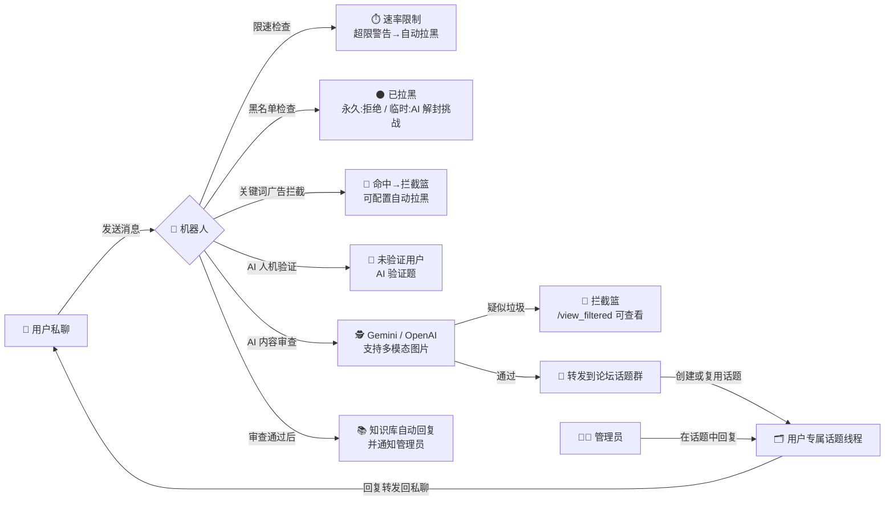

<h1 align="center">🛡️ pivkeyu_pmbot</h1>

<p align="center">
  <em>AI 驱动的 Telegram 双向聊天机器人：用户消息直达管理员，论坛话题工单管理，全维度安全防护与监控</em>
</p>

<p align="center">
  
  
  
  
  
  
  
  <a href="https://github.com/PivKeyU/pivkeyu_pmbot/stargazers">
    
  </a>
</p>

---

## 📜 目录

- [✨ 项目简介](#-项目简介)
- [🚀 功能特性](#-功能特性)
- [🏗️ 架构与消息流](#-架构与消息流)
- [⚡ 快速开始](#-快速开始)
- [⚙️ 配置指南](#-配置指南)
- [📖 命令参考](#-命令参考)
- [🎯 功能使用指南](#-功能使用指南)
- [❓ 常见问题 (FAQ)](#-常见问题-faq)
- [🧰 技术栈](#-技术栈)
- [🤝 贡献指南](#-贡献指南)
- [📄 许可证](#-许可证)
- [⭐ Star 支持](#-star-支持)

---

## ✨ 项目简介

一个功能完善、AI 驱动的 Telegram 双向聊天机器人：用户通过私聊把消息交给机器人，机器人自动为每位用户创建**论坛话题 (Forum Topic) 工单**转发给管理员，管理员在话题中回复后实时回传用户——既是客服工单系统，也是反骚扰安全网关。

核心卖点：**AI 内容审查 + AI 人机验证 + 关键词广告拦截**三重防护过滤垃圾与骚扰；同时提供 **TG 群/频道关键词监听、网页变化监控、RSS 订阅推送**等监控能力；配合 `/inbox` 待办聚合、分组广播、网络测试、安全自更新等运维工具，开箱即用。

**适用于以下场景：**

- 需要屏蔽骚扰/垃圾消息的公开 Telegram 客服机器人
- 管理员想用「私聊 → 论坛话题工单」模式集中处理用户消息
- 需要监听 TG 群/频道关键词、网页价格/库存变化、RSS 更新推送

---

## 🚀 功能特性

### 🗣️ 双向沟通

| 特性 | 说明 |
| :--- | :--- |
| 💬 **论坛话题工单** | 每位用户自动分配独立话题线程，消息自动附带用户信息卡片，便于追溯与管理 |
| 📦 **全媒体递送** | 转发文本、图片、视频、音频、语音、文档、贴纸、动画，并保留 Markdown 格式 |
| 🔄 **双向同步** | 用户消息转发到话题，管理员在话题中回复自动回传；双方**编辑**消息也会同步更新 |
| 👁️ **已读标记** | 管理员回复成功后，话题中的消息自动打上 👁️ 反应，一眼识别已处理 |
| 📋 **待办小本本 `/inbox`** | 列出最近发来消息、管理员尚未回复的用户话题，附内容预览与深链一键跳转 |

### 🤖 AI 能力

| 特性 | 说明 |
| :--- | :--- |
| 🕵️ **AI 内容审查** | Gemini / OpenAI 双提供商，识别垃圾信息与恶意内容，支持图片等多模态输入 |
| 🧩 **AI 人机验证** | 新用户首次交互需完成 AI 生成的验证题，答错自动换题，超限自动拉黑；无 API Key 时自动使用本地题库兜底 |
| 🔓 **AI 自助解封** | 被临时拉黑的用户可答 AI 挑战题自助解封，无需管理员介入 |
| 📚 **知识库自动回复** | 审查通过后基于知识库自动回答用户，支持 Markdown，回复同时通知管理员 |
| 🎨 **AI 模型衣柜** | `/panel` 中为「内容审查 / 验证题生成 / 自动回复」分别挑选模型，可动态切换提供商与模型 |

### 🛡️ 安全防护

| 特性 | 说明 |
| :--- | :--- |
| ⚫ **黑名单管理** | 管理员可拉黑/解封用户；被拉黑用户可答 AI 挑战题自助解封（永久拉黑除外） |
| 🚫 **关键词广告拦截** | 在 AI 审查前做轻量关键词拦截，可配置命中后自动拉黑，降低固定话术处理成本 |
| 🎫 **审查通行证** | 为可信用户发放临时（按小时）/永久豁免，跳过 AI 内容审查，其余规则仍生效 |
| ⏱️ **速率限制** | 按用户限速（默认 30 条/分钟），多次超限自动永久拉黑，防刷屏攻击 |

### 🔎 监控体系

| 特性 | 说明 |
| :--- | :--- |
| 📡 **TG 群/频道监听** | Bot 入群监听 + Telethon 用户会话监听（Bot 无法加入的群/频道），支持关键词、排除词、去重与最小推送间隔 |
| 🕸️ **网页监控** | CSS 选择器解析条目，支持新条目、关键词命中、内容/价格/库存变化提醒，任务防重叠 |
| 📰 **RSS 订阅推送** | 私聊管理订阅源、关键词、自定义页脚与链接预览；新条目最多推送 5 条，多余用摘要提示防刷屏 |
| 📊 **运行状态** | `/monitor_status` 查看 RSS / TG / 网页监控的运行状态、最近失败原因与耗时 |

### 🛠️ 管理工具

| 特性 | 说明 |
| :--- | :--- |
| 🎛️ **女仆长面板 `/panel`** | 统计、黑名单、拦截篮、豁免名单、自动回复、广播分组、监控、模型等一站式管理 |
| 📢 **分组与广播** | 管理用户分组，向全部用户或指定分组广播文本/媒体消息，回复源消息可后续编辑同步 |
| 🌐 **网络测试** | 通过 SSH 远程服务器执行 Ping 与 NextTrace 路由追踪（ICMP/TCP），授权用户可用，目标地址防注入校验 |
| 🔧 **安全更新** | `/updatebot` 仅执行 `ff-only` 更新并支持回滚，本地有未提交改动时拒绝更新 |
| 🗄️ **aiosqlite 连接池** | 8 连接池 + 事务安全包装（出错自动回滚），高并发下数据库读写稳定 |

---

## 🏗️ 架构与消息流



> 管理员在话题中的回复与**编辑**都会被同步回用户的私聊会话；用户的编辑同样会同步到话题中。

### 项目结构

```
pivkeyu_msg/
├── bot.py                  # 启动入口：初始化数据库、注册命令/处理器、启动轮询
├── config.py               # 环境变量加载与配置校验（python-dotenv）
├── handlers/               # Telegram 事件处理器
│   ├── command_handler.py  #   /panel /inbox /exempt /group /broadcast 等命令
│   ├── user_handler.py     #   用户私聊消息：限速→黑名单→验证→审查→转发
│   ├── admin_handler.py    #   管理员话题回复回传、编辑同步、拦截篮查看
│   └── callback_handler.py #   内联键盘回调（面板、模型衣柜、分页等）
├── services/               # 核心业务服务
│   ├── ai_service.py       #   AI 提供商抽象（Gemini / OpenAI）+ 本地题库兜底
│   ├── verification.py     #   AI 人机验证（换题、超限拉黑）
│   ├── blacklist.py        #   黑名单与 AI 自助解封挑战
│   ├── spam_filter.py      #   关键词广告拦截
│   ├── thread_manager.py   #   论坛话题创建、用户信息卡片、深链
│   ├── tg_monitor.py       #   TG 群/频道监听（bot + Telethon 双模式）
│   ├── web_monitor.py      #   网页监控（CSS 解析、变化检测、防重叠）
│   ├── broadcast.py        #   分组广播（文本/媒体 + 话题镜像）
│   └── safe_update.py      #   安全更新（ff-only + 回滚）
├── rss/                    # RSS 订阅（feedparser + 关键词过滤 + 超时兜底）
├── network_test/           # 网络测试（SSH Ping / NextTrace，防注入）
├── database/               # aiosqlite 连接池与全部建表/迁移
├── utils/                  # 装饰器（admin_only）、Markdown、媒体转换、消息发送
└── watchtower/             # Watchtower 自动更新配置（含 Telegram 通知示例）
```

---

## ⚡ 快速开始

> [!TIP]
> 推荐使用 Docker 部署，免去环境配置的麻烦。配置文件与数据均存放在宿主机，升级容器不丢数据。

### 1. 准备配置

创建部署目录并下载配置模板（或直接复制本仓库的 `.env.example`）：

```bash
mkdir tg-bot-data && cd tg-bot-data
wget https://raw.githubusercontent.com/PivKeyU/pivkeyu_pmbot/main/.env.example -O .env
nano .env   # 填入 BOT_TOKEN、FORUM_GROUP_ID、ADMIN_IDS 等配置
```

### 2. 使用 Docker Compose（推荐）

```yaml
services:
  pivkeyu-pmbot:
    container_name: pivkeyu-pmbot
    image: pivkeyu/pivkeyu_pmbot:latest
    restart: unless-stopped
    env_file:
      - .env
    volumes:
      - ./data:/app/data
```

```bash
docker compose up -d
```

更新容器：

```bash
docker compose down && docker compose pull && docker compose up -d
```

> [!NOTE]
> 仓库根目录提供两份等效的 Compose 文件（`docker-compose.yml` 与 `dockercompose.yaml`），均使用镜像 `pivkeyu/pivkeyu_pmbot:latest`，任选其一即可。

> 使用 [Watchtower 自动更新本项目](watchtower/README.md)（仓库提供 `watchtower/docker-compose.yml`，含 shoutrrr 通知配置示例）。

### 3. 使用 Docker Run

```bash
docker run -d \
  --name pivkeyu-pmbot \
  -v $(pwd)/.env:/app/.env \
  -v $(pwd)/data:/app/data \
  --restart unless-stopped \
  pivkeyu/pivkeyu_pmbot:latest
```

> **命令解析：** `-d` 后台运行；`--name` 指定容器名；两个 `-v` 分别挂载 `.env` 配置与 `data` 数据目录（持久化 SQLite 数据库与监控数据）；`--restart unless-stopped` 容器退出自动重启；末尾为 Docker Hub 镜像名。

### 4. 手动部署（可选）

```bash
git clone https://github.com/PivKeyU/pivkeyu_pmbot.git
cd pivkeyu_pmbot

# 创建并激活虚拟环境
python -m venv venv
source venv/bin/activate        # Linux/Mac
# venv\Scripts\activate         # Windows

pip install -r requirements.txt

# 配置环境变量
cp .env.example .env
nano .env

# 启动
python bot.py
```

> **注意：** `/updatebot` 安全更新基于 git 工作区，需要以 `git clone` 方式部署（而非直接下载压缩包）才能使用该功能。

---

## ⚙️ 配置指南

所有配置通过 `.env` 文件加载（项目使用 `python-dotenv`）。以下变量与 `config.py` / `.env.example` 逐项核对列出，请按需填写。

### 🤖 Bot / 管理员（必填）

| 变量 | 必填 | 默认值 | 说明 |
| :--- | :---: | :--- | :--- |
| `BOT_TOKEN` | ✅ | 无 | Telegram Bot Token，从 [@BotFather](https://t.me/BotFather) 获取 |
| `FORUM_GROUP_ID` | ✅ | 无 | 论坛话题群组 ID（超级群组需开启 Topics），机器人须为该群管理员；**未设置时除 `/getid` 外全部功能禁用** |
| `ADMIN_IDS` | ✅ | 无 | 管理员 Telegram 用户 ID，多个用逗号分隔（如 `123456789,987654321`） |

### 🧠 AI

| 变量 | 必填 | 默认值 | 说明 |
| :--- | :---: | :--- | :--- |
| `GEMINI_API_KEY` | ❌ | 空 | Gemini API 密钥，从 [Google AI Studio](https://aistudio.google.com/api-keys) 获取；配置后启用 AI 审查/自动回复 |
| `GEMINI_BASE_URL` | ❌ | 空 | Gemini 自定义 Base URL（兼容网关/代理），留空使用官方接口 |
| `OPENAI_API_KEY` | ❌ | 空 | OpenAI API 密钥（可选，作为第二提供商，可在面板中切换） |
| `OPENAI_BASE_URL` | ❌ | `https://api.openai.com/v1` | OpenAI Base URL，可指向兼容网关 |
| `ENABLE_AI_FILTER` | ❌ | `true` | 是否启用 AI 内容审查 |
| `AI_CONFIDENCE_THRESHOLD` | ❌ | `70` | AI 判断置信度阈值（0-100）。**预留配置，当前代码未使用** |

### 🔀 功能开关 / 数据库 / 队列

| 变量 | 必填 | 默认值 | 说明 |
| :--- | :---: | :--- | :--- |
| `VERIFICATION_ENABLED` | ❌ | `true` | 是否启用新用户 AI 人机验证 |
| `AUTO_UNBLOCK_ENABLED` | ❌ | `true` | 是否启用黑名单用户 AI 挑战自助解封 |
| `DATABASE_PATH` | ❌ | `./data/bot.db` | SQLite 数据库路径（容器内路径通常无需修改） |
| `MAX_WORKERS` | ❌ | `5` | 消息队列 Worker 数量。**预留配置，当前代码未使用** |
| `QUEUE_TIMEOUT` | ❌ | `30` | 队列消息超时时间（秒）。**预留配置，当前代码未使用** |

### ✅ 验证 / 限速

| 变量 | 必填 | 默认值 | 说明 |
| :--- | :---: | :--- | :--- |
| `VERIFICATION_TIMEOUT` | ❌ | `300` | 人机验证会话超时时间（秒） |
| `MAX_VERIFICATION_ATTEMPTS` | ❌ | `3` | 用户最大尝试验证次数，超限自动拉黑 |
| `MAX_MESSAGES_PER_MINUTE` | ❌ | `30` | 每用户每分钟最大消息数，收到警告后继续刷屏会永久拉黑 |

### 📡 TG 群/频道监听（扩展配置）

| 变量 | 必填 | 默认值 | 说明 |
| :--- | :---: | :--- | :--- |
| `TG_API_ID` | ❌ | 空 | Telegram API ID，从 https://my.telegram.org 获取，`user_session` 监听需要 |
| `TG_API_HASH` | ❌ | 空 | Telegram API Hash，同上 |
| `TG_API_SESSION` | ❌ | 空 | Telethon StringSession，**未配置时用户会话监听不会启动** |
| `TG_PROXY` | ❌ | 空 | 可选代理，如 `socks5://127.0.0.1:1080` 或 `http://127.0.0.1:7890` |
| `TG_MONITOR_ENABLED` | ❌ | `true` | 是否允许启动 TG 监听服务 |
| `TG_MONITOR_DEFAULT_SOURCE` | ❌ | `user_session` | 新监听默认来源：`user_session` 或 `bot` |
| `TG_MONITOR_NOTIFY_CHAT_IDS` | ❌ | 空 | TG 监听推送目标（逗号分隔），留空则使用 `ADMIN_IDS` |

### 🚫 关键词广告拦截（扩展配置）

| 变量 | 必填 | 默认值 | 说明 |
| :--- | :---: | :--- | :--- |
| `SPAM_KEYWORD_FILTER_ENABLED` | ❌ | `false` | 是否启用关键词广告拦截（也可运行时用 `/spamrules on` 开启） |
| `SPAM_KEYWORD_AUTO_BLOCK` | ❌ | `true` | 命中后是否自动拉黑 |

### 📰 RSS（代码支持，未收录于 .env.example）

| 变量 | 必填 | 默认值 | 说明 |
| :--- | :---: | :--- | :--- |
| `RSS_ENABLED` | ❌ | `false` | 是否启用 RSS 轮询推送（也可运行时在 `/panel` → RSS 管理中开启） |
| `RSS_DATA_FILE` | ❌ | `./data/rss_subscriptions.json` | RSS 订阅数据文件 |
| `RSS_CHECK_INTERVAL` | ❌ | `300` | RSS 轮询间隔（秒），建议 ≥ 120 |
| `RSS_AUTHORIZED_USER_IDS` | ❌ | 空 | RSS 命令授权用户（逗号分隔），不填则仅 `ADMIN_IDS` 可用 |

### 🔔 Watchtower 通知钩子（可选）

| 变量 | 必填 | 默认值 | 说明 |
| :--- | :---: | :--- | :--- |
| `WATCHTOWER_NOTIFICATIONS` | ❌ | 空 | 使用 shoutrrr 作为统一通知系统，启用需去除 `#` 注释并设为 `shoutrrr` |
| `WATCHTOWER_NOTIFICATION_URL` | ❌ | 空 | 通知渠道钩子，如 `telegram://token@telegram?chats=channel-1[,chat-id-1,...]` |

### 🔑 获取必要信息

1. **Bot Token**：与 [@BotFather](https://t.me/BotFather) 对话，使用 `/newbot` 创建机器人即可获得。
2. **话题群组 ID**：创建超级群组并启用「话题」(Topics)，将机器人添加为管理员，在群组中发送 `/getid`，机器人会自动回复群组 ID。
3. **Gemini API 密钥**（可选）：访问 [Google AI Studio](https://aistudio.google.com/api-keys) 创建。
4. **Telethon StringSession**（可选，user_session 监听）：在 https://my.telegram.org 获取 API ID/Hash，再用任意 Telethon 工具生成 StringSession 填入 `TG_API_SESSION`。

### 🗺️ 功能启用速查表

| 想用哪个功能 | 需要哪些配置 | 之后用什么操作 |
| :--- | :--- | :--- |
| 双向聊天工单 | `BOT_TOKEN` + `FORUM_GROUP_ID` + `ADMIN_IDS` | 用户直接私聊即可 |
| AI 内容审查 | 至少一个 API Key + `ENABLE_AI_FILTER=true` | 无需操作，自动生效；面板可切换提供商/模型 |
| AI 人机验证 | 默认开启；无 Key 走本地题库 | 新用户自动触发 |
| AI 自助解封 | `AUTO_UNBLOCK_ENABLED=true` | 被拉黑用户发消息自动触发 |
| 关键词广告拦截 | 无需额外配置 | `/spamrules on` → `/spamrules add 广告词` |
| 审查通行证 | 无需额外配置 | `/exempt <user_id> permanent\|temp <小时数>` |
| 分组与广播 | 无需额外配置 | `/group create` → `/broadcast group <分组名> <内容>` |
| 网络测试 | 无需额外配置 | `/adduser <user_id>` 授权 → `/addserver` 登记 → `/ping` |
| TG 监听（bot 模式） | 把 Bot 拉进目标群即可 | `/tgmon add <名称> <chat_id> <关键词> bot` |
| TG 监听（user_session） | `TG_API_ID` + `TG_API_HASH` + `TG_API_SESSION` | `/tgmon add <名称> <chat_id> <关键词> user_session` |
| 网页监控 | 无需额外配置 | `/webmon add <名称> <url> [关键词]` |
| RSS 推送 | `RSS_ENABLED=true`（或面板开启） | `/rss_add <url>` |
| 安全更新 | git 方式部署 | `/updatebot status` → `/updatebot apply` |
| Watchtower 自动更新 | 见 [watchtower/README.md](watchtower/README.md) | `docker compose up -d` |

---

## 📖 命令参考

> 命令菜单会在启动时自动同步到 Telegram（私聊 / 群聊分别设置）。以下命令表与代码 `services/telegram_commands.py` 保持一致。
>
> 管理员功能（`FORUM_GROUP_ID` + `ADMIN_IDS` 均设置时）在私聊和群聊中都会注册，群聊便于在话题内直接操作。

### 👤 用户命令（私聊与群聊通用）

| 命令 | 描述 |
| :--- | :--- |
| `/start` | 唤醒女仆（仅私聊） |
| `/getid` | 查看主人 ID / 查看群组 ID |
| `/ping` | 端来 Ping 测试（需授权，每 15 秒一次） |
| `/nexttrace` | 端来路由追踪（需授权，每 10 秒一次） |
| `/adduser` | 登记授权主人（管理员） |
| `/rmuser` | 移除授权主人（管理员） |
| `/addserver` | 登记测试服务器（管理员，支持 5 步向导或一次性参数） |
| `/rmserver` | 撤下测试服务器（管理员） |
| `/install_nexttrace` | 安装追踪工具（管理员） |

### 🧑‍💼 管理员命令（私聊与群聊）

| 命令 | 描述 |
| :--- | :--- |
| `/help` | 查看女仆小手册（仅私聊） |
| `/block` | 记入黑名单（可在用户话题中使用，自动定位用户） |
| `/unblock` | 移出黑名单 |
| `/panel` | 打开女仆长面板 |
| `/blacklist` | 查看黑名单小本本 |
| `/stats` | 查看宅邸统计 |
| `/inbox` | 查看待办小本本 |
| `/view_filtered` | 查看拦截篮 |
| `/autoreply` | 管理自动回复女仆与知识库 |
| `/exempt` | 管理审查通行证 |
| `/group` | 管理用户分组 |
| `/broadcast` | 发送用户广播 |
| `/spamrules` | 管理关键词拦截 |
| `/tgmon` | 管理 TG 监听 |
| `/webmon` | 管理网页监控 |
| `/monitor_status` | 查看监听状态 |
| `/updatebot` | 安全更新机器人 |

### 📰 RSS 命令（仅限私聊）

| 命令 | 描述 |
| :--- | :--- |
| `/rss_add <url>` | 添加 RSS 茶点 |
| `/rss_remove <url\|ID>` | 撤下 RSS 茶点 |
| `/rss_list` | 查看 RSS 茶点 |
| `/rss_addkeyword <id> <关键词>` | 添加 RSS 口味词 |
| `/rss_removekeyword <id> <关键词>` | 删除 RSS 口味词 |
| `/rss_listkeywords <id>` | 查看 RSS 口味词 |
| `/rss_removeallkeywords <id>` | 清空 RSS 口味词 |
| `/rss_setfooter [文本]` | 设置 RSS 小尾巴 |
| `/rss_togglepreview` | 切换链接预览 |
| `/rss_add_user <user_id>` | 登记 RSS 授权（管理员） |
| `/rss_rm_user <user_id>` | 移除 RSS 授权（管理员） |

---

## 🎯 功能使用指南

### 📡 TG 群/频道关键词监听

两种监听来源：

- **`bot` 模式**：机器人已在目标群/频道中，零配置直接监听；
- **`user_session` 模式**：通过 Telethon 使用用户会话监听 Bot 无法加入的群/频道，需要完整配置 `TG_API_ID`、`TG_API_HASH`、`TG_API_SESSION`（可选 `TG_PROXY`）。

```bash
/tgmon add 监听名称 -1001234567890 关键词1,关键词2 user_session
/tgmon list
/tgmon discovered        # 查看用户会话发现的群/频道
/tgmon on 1
/tgmon off 1
/tgmon keywords 1 新关键词1,新关键词2    # 更新监听词
/tgmon exclude 1 排除词1,排除词2        # 设置排除词
/tgmon interval 1 300                    # 设置最小推送间隔（秒）
/tgmon delete 1
```

> 论坛话题群自身（`FORUM_GROUP_ID`）不会被记录进发现列表，避免污染 `/tgmon discovered`。

### 🕸️ 网页监控

CSS 选择器自动解析页面条目（标题、链接、正文、价格、库存），检测以下变化并推送管理员：

- **新条目**：出现此前未见过的条目（首次添加只建立基线，不推送已有内容）；
- **关键词命中**：条目标题/正文命中关键词；
- **内容变化 / 价格变化 / 库存变化**：已有条目内容哈希、价格或库存发生变化。

```bash
/webmon add 监控名称 https://example.com 关键词1,关键词2
/webmon list
/webmon run 1        # 立即手动检查一次
/webmon keywords 1 新关键词1,新关键词2
/webmon interval 1 300
/webmon off 1
/webmon delete 1
```

### 🚫 关键词广告拦截

在 AI 审查之前做轻量关键词过滤，命中消息进入拦截篮，可配置自动拉黑：

```bash
/spamrules on
/spamrules add 广告词1,广告词2
/spamrules autoblock on    # 命中后自动拉黑
/spamrules del 广告词1
/spamrules                  # 查看当前设置
/spamrules clear            # 清空全部关键词
```

### 📰 RSS 订阅推送

RSS 功能默认关闭，先在 `.env` 设置 `RSS_ENABLED=true`（或 `/panel` → RSS 订阅茶点管理 中开启），重启后：

```bash
/rss_add https://example.com/feed.xml
/rss_list
/rss_addkeyword 1 关键词          # 只推送命中关键词的条目
/rss_setfooter 来自女仆的问候       # 自定义页脚
/rss_togglepreview                # 切换链接预览
```

> 首次添加订阅只建立基线，不推送已有文章；每个周期最多推送 5 条新条目，超出部分以摘要提示，防刷屏。

### 📢 分组与广播

```bash
/group create 高优用户 重要客户分组
/group add 高优用户 123456789        # 在用户话题中可省略 user_id
/group members 高优用户
/group list

/broadcast all 大家好，系统维护公告
/broadcast group 高优用户 针对高优用户的通知
```

也可以**回复**一条文本/图片/视频/文件消息后执行 `/broadcast all` 或 `/broadcast group <分组名>`，广播后编辑源消息可同步更新已投递内容。

### 🌐 网络测试（SSH Ping / NextTrace）

```bash
/adduser 123456789          # 管理员：授权用户使用网络测试
/addserver                  # 管理员：启动 5 步登记向导（或 /addserver "香港 - GCP" 1.2.3.4 22 user pass）
/install_nexttrace          # 管理员：为服务器安装 NextTrace

/ping example.com 4         # 授权用户：Ping 测试（选择服务器）
/nexttrace example.com      # 授权用户：路由追踪（选择 ICMP / TCP 模式）
```

> 目标地址经过严格校验（`validate_target` + `shlex.quote`），防止 SSH 命令注入；服务器凭据保存在 `data/network_test_config.json`。

### 🔧 安全更新与运行状态

```bash
/monitor_status             # 查看全部监控运行状态
/monitor_status rss
/monitor_status tg
/monitor_status web

/updatebot status           # 检查 git 状态（分支、领先/落后、脏工作区）
/updatebot apply            # 执行 ff-only 更新
/updatebot rollback         # 回滚到上一次更新前
```

> `/updatebot apply` 会拒绝覆盖本地未提交改动，只执行 `ff-only` 更新；更新完成后需按部署方式重启 Bot。

### 🎛️ 女仆长面板 `/panel`

面板一站式管理：黑名单、主人名册、拦截消息篮、自动回复女仆、审查通行证、网络测试茶具、广播与分组、RSS 订阅、TG 监听、网页监控、关键词拦截、运行状态、安全更新、**AI 模型衣柜**（分别配置 Gemini / OpenAI 的内容审查、验证题生成、自动回复模型）。

---

## ❓ 常见问题 (FAQ)

**Q1：用户发了消息，为什么管理员没收到？**

消息要经过「限速 → 黑名单 → 关键词拦截 → 人机验证 → AI 审查」多道关卡，任一关被拦下管理员就收不到：

1. **触发限速**：收到限速提醒后继续刷屏会被自动拉黑；
2. **被拉黑**：永久拉黑直接拒绝，临时拉黑需完成 AI 解封挑战；
3. **命中关键词广告拦截**：消息进入拦截篮，管理员可用 `/view_filtered` 查看；
4. **未通过 AI 人机验证**：新用户首次发消息会收到验证题，答对后才递送；
5. **AI 审查判为垃圾**：同样进入拦截篮，不会转发到话题群。

**Q2：如何获取群组 ID？**

把机器人加为群组管理员，在群里发送 `/getid`，机器人会回复「群组 ID」和「您的用户 ID」。

**Q3：`user_session` 监听需要什么？**

必须同时满足：Telethon 已安装（`requirements.txt` 自带）；`TG_API_ID`、`TG_API_HASH`、`TG_API_SESSION` 三项完整配置（缺任一项监听都不会启动）；`TG_MONITOR_ENABLED` 为 `true`；且存在至少一个启用中、来源为 `user_session` 的监听。

**Q4：`/updatebot apply` 失败怎么办？**

失败是保护机制生效：本地有未提交改动、本地分支领先远端、或没有可用的回滚点。先提交/清理本地改动再重试；`/updatebot rollback` 可回滚到上一次更新前。

**Q5：验证失败被拉黑，还能解封吗？**

临时拉黑可重新发消息触发 AI 解封挑战自动开门；永久拉黑（管理员 `/block`、关键词拦截自动拉黑、多次超限等）只能由管理员 `/unblock` 解封。

**Q6：为什么 `/tgmon discovered` 看不到我的论坛群？**

这是刻意设计：论坛话题群自身（`FORUM_GROUP_ID`）不会再被记录进发现列表，避免污染 `/tgmon discovered`；其余群/频道照常被发现与监听。

**Q7：网页监控添加后为什么不推送？**

首次检查只建立基线、不推送已有内容；之后出现新条目、关键词命中或内容/价格/库存变化才会推送。可先用 `/webmon run <ID>` 手动触发一次检查验证。

**Q8：RSS 命令没反应？**

RSS 命令仅限私聊使用，且只有 `ADMIN_IDS` 与 `RSS_AUTHORIZED_USER_IDS` 中的用户可用；另外 `RSS_ENABLED` 默认 `false`，未开启时不会轮询推送（可在 `/panel` → RSS 功能管理中开启）。

**Q9：不配置任何 API Key 能跑起来吗？**

可以。人机验证会自动使用内置本地题库兜底（AI 生成的题在无 Key 或调用失败时也会回退）；但 AI 内容审查会放行（`No AI provider configured`）、知识库自动回复不会回复。要获得完整的 AI 能力，至少配置一个 API Key。

**Q10：为什么仓库里有两个 compose 文件？**

根目录的 `docker-compose.yml` 与 `dockercompose.yaml` 内容等效，均使用镜像 `pivkeyu/pivkeyu_pmbot:latest`，任选其一即可；`watchtower/` 目录提供配套的 Watchtower 自动更新配置（含 shoutrrr 通知示例）。

**Q11：Docker 升级容器会丢数据吗？**

不会。`.env` 配置与 `data` 目录均通过卷挂载在宿主机上（`-v ./data:/app/data`），SQLite 数据库、RSS 订阅、网络测试配置、监控数据都会保留。

**Q12：如何让用户使用网络测试功能？**

管理员执行 `/adduser <user_id>` 把用户加入授权名单（数据保存在 `data/network_test_config.json`）；授权用户即可使用 `/ping` 与 `/nexttrace`。移除授权用 `/rmuser <user_id>`。

---

## 🧰 技术栈

| 技术 | 用途 |
| :--- | :--- |
| [Python 3.11+](https://www.python.org/) | 开发语言（Docker 基础镜像 `python:3.11-slim`） |
| [python-telegram-bot v20+](https://github.com/python-telegram-bot/python-telegram-bot) | Telegram Bot 框架（长轮询 + 异步） |
| [aiosqlite](https://github.com/omnilib/aiosqlite) | 异步 SQLite，内置 8 连接池与事务安全包装 |
| [Google Gemini](https://ai.google.dev/) | AI 内容审查 / 验证题生成 / 自动回复 / 多模态识别 |
| [OpenAI](https://openai.com/) | 可选第二 AI 提供商 |
| [Telethon](https://github.com/LonamiWebs/Telethon) | 用户会话监听 Bot 无法加入的群/频道 |
| [aiohttp](https://docs.aiohttp.org/) | 异步 HTTP 抓取（网页监控） |
| [BeautifulSoup4](https://www.crummy.com/software/BeautifulSoup/) | 网页 CSS 选择器解析 |
| [feedparser](https://pythonhosted.org/feedparser/) | RSS 解析（socket 超时 + 任务防重叠） |
| [paramiko](https://github.com/paramiko/paramiko) | SSH 远程网络测试（Ping / NextTrace） |
| [Docker](https://www.docker.com/) | 容器化部署（amd64 / arm64 多架构镜像） |

---

## 🤝 贡献指南

欢迎任何形式的贡献！如果您有好的想法或发现了 Bug，请随时提交 Pull Request 或创建 Issue。

开发小贴士：

- 项目包含 `pytest` / `pytest-asyncio` 测试依赖，提交前建议运行 `black` 与 `flake8`（见 `requirements.txt` 开发工具段）；
- 新增命令时，请同步更新 `services/telegram_commands.py` 中的命令菜单（私聊/群聊两套），以及本 README 的命令参考表；
- 新增环境变量时，请同步更新 `config.py` 与 `.env.example`，并在配置指南中补充说明。

## 📄 许可证

本项目采用 [MIT 许可协议](LICENSE)。

---

<p align="center">
  如果这个项目对你有帮助，请给个 Star ⭐️
</p>
<p align="center">
  <a href="https://www.star-history.com/#PivKeyU/pivkeyu_pmbot&type=date">
    
  </a>
</p>
